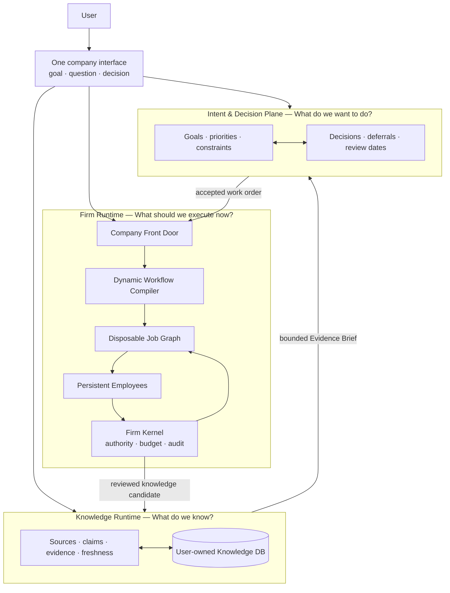
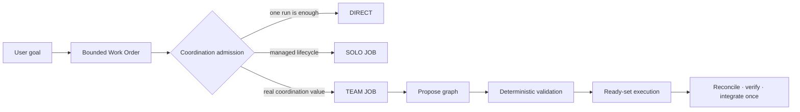

# Noruct

> **A persistent AI company that turns goals into adaptive work, while its employees and organizational capability improve over time.**

Noruct is an AI agent platform organized as a company rather than a collection of user-configured bots.
The user talks to one company. The company decides whether one employee is enough, when a managed Job
is necessary, which work can run independently, what must be reviewed, and whether the first plan should
change as evidence arrives.

The central thesis is:

> **Workflows are disposable. Organizational capability accumulates.**

## One interface, three planes

The three planes are connected, but they are not merged into one limitless context:

- **Knowledge Runtime** preserves sources, facts, evidence, provenance, and freshness.
- **Intent & Decision Plane** preserves goals, constraints, open questions, decisions, and review dates.
- **Firm Runtime** selects employees, builds bounded execution graphs, uses tools, verifies results, and returns one answer.

This separation prevents employee memory, user knowledge, company policy, and transient workflow state from
silently contaminating one another.

## How the company works

For each request, Noruct chooses the smallest useful execution form:

1. **DIRECT** — one persistent employee answers without creating a workflow graph.
2. **SOLO JOB** — one employee runs inside a managed Job when audit, tools, approval, or budgets are needed.
3. **TEAM JOB** — a validated dependency graph is created only when independent work, capability separation,
   or an independent review boundary justifies a team.

Parallel execution is not a feature toggle. It is a consequence of dependency analysis. Only tasks whose
dependencies are satisfied may run concurrently.

The first plan is a hypothesis. Within explicit limits, execution can retry, reroute, insert, split, join,
merge, or cancel work. A valid current graph is preserved when a proposed rewrite is invalid or its mutation
budget is exhausted.

## Persistent company, temporary projects

Noruct keeps long-lived company state:

- **COMPANY** — purpose, policy, permission, cost limits, and review posture.
- **ROSTER** — persistent employees, roles, capabilities, and lifecycle state.
- **PLAYBOOK** — verified decomposition, collaboration, and review patterns.
- **EMPLOYEE MEMORY / SKILL** — employee-specific continuity and approved procedures.

Per-request Work Orders, project teams, task graphs, temporary specialists, and model context are disposable.
Audit evidence can remain, but it does not automatically become workflow authority or long-term knowledge.

## Evidence-gated evolution

Most Jobs should leave no permanent learning. Meaningful evidence may produce one of three reviewed changes:

| Patch | Durable change |
|---|---|
| **Skill Patch** | One employee's reusable procedure or expertise |
| **Workflow Patch** | Decomposition, ordering, parallelism, routing, or review pattern |
| **Roster Patch** | Roles, capabilities, activation, dormancy, or authority boundaries |

These are versioned proposals, not unrestricted self-modification. Qualification, approval policy,
observation, rollback, budget, and authority boundaries remain explicit.

## Knowledge intake without mandatory labeling

The external knowledge system assumes users may provide a PDF, DOCX, image, note, spreadsheet, or other
unstructured asset without labeling it first. Originals, derived representations, and semantic records remain
separate. Low-confidence extraction remains a candidate; claims stay traceable to a source revision; only a
small task-specific Evidence Brief enters a Job.

## Shared evolution

Shared evolution is optional. A local Noruct installation must work without joining a network. When enabled,
the network can distribute signed, versioned skills, tools, employee definitions, and playbooks through explicit
review, pin, update, and rollback controls. It must not silently upload private repositories, prompts, credentials,
raw knowledge assets, or employee-private memory.

## Design principles

- Do not create a team when one employee is enough.
- Treat parallelism as a dependency result, not decoration.
- Treat the first plan as a hypothesis.
- Keep high-cost, irreversible, external, or permission-increasing actions behind explicit authority.
- Bound task count, concurrency, retries, graph rewrites, time, tool calls, and cost.
- Keep one final answer owner.
- Prefer audited MIT-licensed foundations for commodity agent capabilities while keeping Noruct's public
  company contracts and state authority first-party.

## Documentation

- [System architecture](docs/architecture.md)
- [Runtime and workflow compiler](docs/runtime.md)
- [Current implementation status](docs/status.md)

## Repository status

This public repository currently publishes the Noruct concept and system contracts. It does not contain the
private development runtime, customer data, credentials, or third-party brand assets. The implementation
status document separates what exists in the development codebase from what is still partial or planned.
