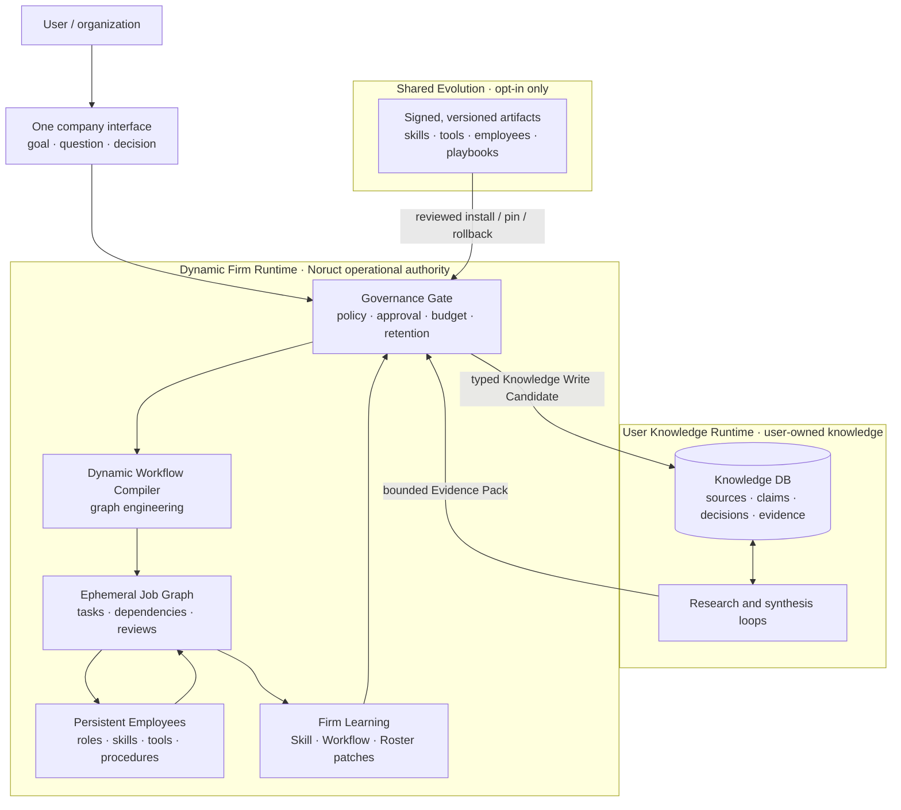
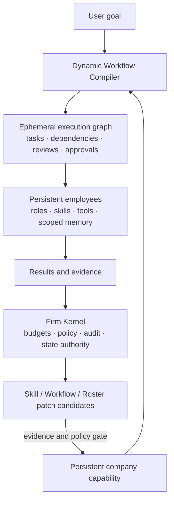
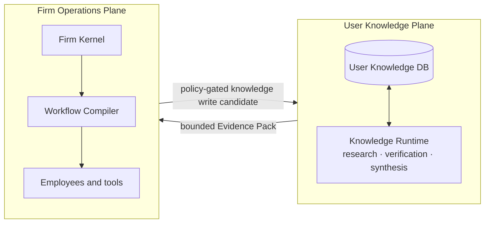
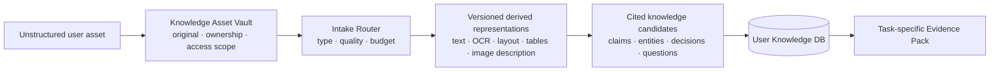

# Noruct

> **A persistent firm that turns goals into adaptive work graphs, while its employees and organizational capability improve over time.**

Noruct is not a visual multi-agent builder. A user gives one company an objective; the company decides whether one employee is enough, which work can run in parallel, what must be reviewed, and when the execution plan should change.

The central idea is simple:

> **Workflows are disposable. Organizational capability accumulates.**

## At a glance

**One product, two protected state planes:** the firm learns how to work; the user-owned Knowledge DB preserves what the user knows. They exchange only bounded, policy-gated artifacts—not full context, raw transcripts, or unrestricted write access.

## The model

Each request can create a temporary project team and task graph. When the work ends, that graph normally disappears. Only evidence-backed improvements to an employee's skill, a collaboration pattern, or the roster itself can become durable company state.

## What the firm does

Given a goal, Noruct can:

1. Decompose the goal into work.
2. Calculate dependencies and identify independent work.
3. Assign the minimum useful set of roles.
4. Run only dependency-ready tasks in parallel.
5. Re-evaluate the graph as results arrive.
6. Split, join, cancel, retry, insert, merge, or reroute tasks within explicit limits.
7. Create a temporary specialist when a real capability gap appears.
8. Propose durable employee, skill, or workflow changes only when evidence supports them.
9. Integrate the final result once, with its relevant evidence and unresolved issues.

The user does not draw the graph, specify agent count, or hand-author a workflow.

## Three kinds of durable improvement

| Patch | Changes |
|---|---|
| **Skill Patch** | An employee's reusable procedure or expertise |
| **Workflow Patch** | Decomposition, sequencing, parallelism, routing, or review pattern |
| **Roster Patch** | Roles, capabilities, activation, dormancy, or authority boundaries |

These are not free-form self-modification. A patch requires evidence, a bounded lifecycle, an applicable policy, and a rollback path.

## Graph engineering and loop engineering

Noruct uses both concepts, but at different levels.

- **Loop engineering** designs how one employee works: observe, plan, act, verify, adjust, and stop under a budget.
- **Graph engineering** connects specialized loops into a company: routing, fan-out, fan-in, review, escalation, and shared task state.

The workflow graph is a hypothesis, not a permanent script. It may change as new evidence arrives, but every mutation is governed by company policy, cost limits, and auditability.

## A user-owned Knowledge Runtime

Noruct also envisions a separate **User Knowledge Runtime**: an external knowledge think tank for an individual or organization.

It is not employee memory and not a mechanism for stuffing old conversations into every model context. It manages a user-owned Knowledge DB containing sources, claims, entities, decisions, questions, evidence, provenance, freshness, and revisions.

The two planes remain separate:

- The firm improves how Noruct performs work.
- The Knowledge DB improves what the user can know, trace, compare, and decide.
- Employees receive only the smallest task-specific Evidence Pack, never the full user database.
- Neither plane may silently mutate the other. Cross-plane actions pass through explicit policy, approval, budget, and retention controls.

## Knowledge intake without mandatory labeling

An external brain cannot require a user to pre-label every file. A user should be able to drop a PDF, DOCX, spreadsheet, image, link, meeting note, or conversation fragment into their Knowledge DB and ask a question later.

The original asset, its derived representations, and its semantic knowledge records are separate layers:

- An extraction never overwrites the original file.
- A low-confidence OCR or model result remains a candidate, not an established fact.
- Every claim must be traceable to a source and revision.
- Unsupported or unreadable files are preserved and reported, never silently treated as understood.
- The full corpus is not inserted into model context; only a bounded Evidence Pack is compiled for a question or job.

Noruct will reuse audited open-source document conversion and knowledge-processing components behind these boundaries rather than reinvent commodity parsers. Raw user assets and their derived content remain private and are never shared through collective evolution.

## Design constraints

- One employee is preferred when one employee is sufficient.
- Parallelism is a consequence of dependency analysis, not a decorative feature.
- The first plan is a hypothesis.
- High-cost, irreversible, external, or permission-increasing actions are not silently performed.
- Workflow mutation count, retries, cost, time, and tool authority are bounded.
- Active job audit data is not automatically long-term knowledge.
- Customer knowledge, prompts, credentials, repositories, and employee-private memory are never shared through a collective evolution network.

## Status

This repository is a public concept note. It intentionally contains no runtime code, customer data, credentials, vendor assets, or implementation dependencies.

Noruct is being developed as an open, commercially responsible AI platform. The public source distribution, license, contribution model, and hosted-service boundaries will be published separately as they are finalized.
