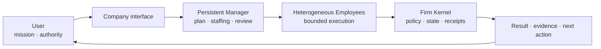

# Noruct

Noruct는 사용자가 하나의 회사 인터페이스에 목표를 전달하면 Persistent Manager와 서로 다른
역할·capability를 가진 Employee가 실행 구조를 만들고, Firm Kernel이 권한·상태·감사 경계를 지키는
AI agent platform을 지향한다. 이 실행 개념의 이름은 **Dynamic Firm Runtime**이다.

현재 저장소는 배포 전 개발본이다. 아래 내용은 제품이 지키려는 공개 계약이며, hosted service,
완전 자율 운영, 외부 효과의 exactly-once delivery 또는 모든 환경의 설치 지원을 주장하지 않는다.

이 공개 Core의 first-party source는 [MIT License](LICENSE)로 배포된다. Vendored·third-party source에는
[THIRD_PARTY_NOTICES.md](THIRD_PARTY_NOTICES.md)와 각 source directory의 원 라이선스가 적용된다.

## 공개 Core와 비공개 hosted service

Noruct의 공개 단위는 package index가 아니라 local-first product monorepo다. Company runtime, CLI/TUI,
Knowledge, 사용자 설정 provider·MCP·일반 web transport와 signed artifact의 client-side 검증·pin·rollback
계약은 공개 Core에 속한다.

Noruct가 운영하는 Shared Evolution/Network server, registry publisher/auth, server benchmark promotion,
remote coordination, billing·tenant operation과 deployment evidence는 비공개 유료 서비스 경계다. 공개 Core는
그 서비스 없이도 사용자 소유 provider와 local state로 작동해야 한다. 현재 source projection은 준비 상태일 뿐
외부 공개가 승인되지 않았고, 웹 installer는 후속 작업이다. 정확한 포함·제외 목록은
[Public Core Boundary](PUBLIC_CORE_BOUNDARY.md)를 따른다.

## Dynamic Firm

- Manager는 목표를 해석하고 조직 구성을 제안하지만 권한, 승인, Company state나 audit을 직접
  바꾸지 않는다.
- Employee는 동결된 Work Order, capability, evidence와 Tool grant 안에서만 실행한다.
- Firm Kernel은 요청, Job Graph, 승인, effect receipt, artifact pin과 terminal result의 최종 권위다.
- 조직을 크게 만드는 것 자체가 목적이 아니다. 강한 SOLO보다 검증된 가치가 있을 때만 TEAM,
  Manager-led 구조나 같은 Employee의 추가 실행을 선택한다.

## 안정적인 외부 Capability

외부 Tool·Skill·Plugin·MCP와 Agent package는 이미 작동하는 사용자 자산이다. Noruct의 재귀 개선이
그 원본을 실험 대상으로 사용해서는 안 된다.

- 외부 Tool·Skill·Plugin은 exact version과 digest에 고정되며 자동 교체되지 않는다.
- 설치된 외부 package 원본을 에이전트가 수정하는 실행 경로는 없다.
- 새 외부 version은 reviewed candidate일 뿐이며, 사용자가 exact version/digest를 검토·설치·활성화해야
  미래 Job에서 사용된다.
- 실행 중 Job은 시작할 때의 artifact와 runtime contract에 pin된다. 새 activation은 다음 Job부터
  적용되고 이전 activation으로 rollback할 수 있다.
- trust profile이나 반복 승인은 기존 grant의 대화 마찰을 줄일 수 있지만 새 capability·permission을
  만들지 않는다.

## 사용성을 방해하지 않는 재귀 개선

Noruct에는 보수적인 재귀 개선 경로가 있다. 목표는 외부 기반을 갑자기 대체하는 것이 아니라, 현재
작동을 유지하면서 Noruct 소유 adapter와 composition을 작은 증거 단위로 개선하는 것이다.

Network provenance가 없는 `LOCAL_DERIVED` artifact만 이 경로의 후보가 된다. 사용자가 Company에서
`always-approve`를 명시한 경우에만 다음 Job 자동 승격 후보가 될 수 있으며, 그 경우에도 다음을 모두
통과해야 한다.

1. cataloged base version과 derivation provenance 확인
2. 기존 사용자 권한과 authority ceiling 검증
3. 같은 runtime contract와 required-capability envelope 확인
4. static shadow compatibility 검사
5. 실행 중 Job pin 보존과 이전 activation rollback 가능성 확인

`always-approve`는 검증 생략이나 외부 update 동의가 아니다. 출처 불명, Network-imported, user-imported,
권한 확대, 계약 불일치 또는 모호한 결과는 명시적 review에 남는다. 검증 실패는 현재 version을 그대로
유지하며 정상 Job 완료를 방해하지 않는다.

## Knowledge와 LLM Wiki 역할

Noruct의 Knowledge Runtime은 문서를 모두 prompt에 넣는 긴 context가 아니다. 사용자 소유 원본에서
현재 결정에 필요한 근거만 선택하고 다음을 구분하는 **실행 연결형 LLM Wiki 기반**이다.

| 구분 | 의미 |
|---|---|
| Source | 사용자가 소유하는 원본 자료 |
| Evidence | source에 추적 가능한 bounded claim |
| Unknown / Conflict | 모름, 충돌, 오래됨을 숨기지 않는 상태 |
| Intent / Decision | 사용자가 원하는 방향과 선택 |
| Job / Outcome | 실행 기록과 실제로 관측된 결과 |

Knowledge는 Mission, 실행 권한 또는 현실의 성공을 자동 생성하지 않는다. 반복 질문의 가치 있는
synthesis는 reviewable knowledge candidate가 될 수 있지만 trivial answer를 자동 진실로 저장하지 않는다.
따라서 개념적으로 LLM Wiki의 역할을 포함하되, 아직 완전한 wiki 편집 경험이나 Obsidian 대체를
주장하지 않는다.

## 중단과 외부 효과

취소는 rollback과 같지 않다. `WRITE`, `EXECUTE`, `EXTERNAL_COMMUNICATION`이 시작된 뒤 결과를
증명할 수 없으면 Noruct는 그 action을 실패로 추정하거나 자동 재실행하지 않는다.

- unknown effect는 봉인되고 같은 resource의 자동 재사용이 차단된다.
- read-only receipt continuation과 effect reconciliation은 별도 경로다.
- 사용자는 증거 확인, compensation 또는 영구 `sealed unknown` 가운데 하나를 명시적으로 기록할 수 있다.
- provider, tool contract, approval receipt, artifact와 Work Order가 재검증되지 않으면 same-Job
  continuation은 거절되고 새 Job이 필요하다.

이 경계는 중복 effect 가능성을 줄이지만 외부 시스템 전체의 exactly-once를 보장하지 않는다.

## 설치 전 확인: 지원 범위·데이터·외부 AI·위험

Noruct는 현재 **배포 전 개발본**이다. 설치나 실제 workspace 실행 전 다음 경계를 확인해야 한다.

| 항목 | 현재 약속 | 설치 전 알아둘 제한 |
|---|---|---|
| 지원 환경 | CPython 3.11+의 local runtime과 rendered macOS/Linux/WSL installer를 개발·qualification 대상으로 둔다. Windows installer template/CI coverage는 있으나 native interactive terminal qualification은 아직 완료되지 않았다. | approved release host의 실제 HTTPS install/update/rollback 증거와 모든 terminal emulator 지원을 주장하지 않는다. |
| 데이터 | Company/runtime state와 Knowledge DB/Vault는 사용자 로컬 state에 남는다. `noruct data export/delete`와 `noruct knowledge export/delete/restore`는 서로 다른 scope를 명시적으로 다룬다. | export·delete 전에 residual backup과 사용자 원본 Folder의 별도 소유권을 확인해야 한다. 기본 uninstall은 local state를 보존하며 `--purge-state`만 명시 삭제한다. |
| 외부 AI | provider, model, API credential과 subscription은 사용자가 직접 관리한다. API credential은 named environment variable을 통해서만 사용하며 setup/state에 raw value를 저장하지 않는다. | Noruct는 provider, model, quota, availability, 결과 정확성 또는 USD 비용을 보증·대납·재판매하지 않는다. provider의 별도 이용약관·data policy와 과금이 적용된다. |
| Tool과 효과 | file write, command, 외부 통신 같은 effect는 ActionPolicy와 승인·receipt 경계를 거친다. 결과가 불명인 effect는 자동 재실행하지 않는다. | 승인과 receipt가 모든 외부 시스템의 rollback 또는 exactly-once delivery를 보장하지는 않는다. 실제 effect 전에는 target·권한·비용·복구 방법을 확인해야 한다. |
| 알려진 제한 | local-first runtime, explicit artifact activation, content-free operator projection, provider-free regression lane을 제공한다. | unrestricted third-party in-process plugin, silent marketplace update, broad autonomous replanning, customer-shared automatic evolution, silent OAuth sync, hosted multi-user control plane 및 모든 플랫폼의 release qualification은 제공하지 않는다. |

지원 요청에는 raw workspace, prompt, provider credential, token 또는 local state를 보내지 마세요. 가능한 경우
`noruct data support-bundle`의 redacted output과 재현 가능한 command/OS/version 사실만 사용합니다.
Noruct는 raw workspace, prompt, provider credential, token 또는 local state의 지원 제출을 요청하지 않으며,
공개 지원 채널도 약속하지 않습니다.

## 공개 claim-status matrix

아래 상태는 현재 공개 claim의 범위를 구분하며, 지원·법률·결과 보증을 뜻하지 않습니다.

| 공개 claim | status | limitation |
|---|---|---|
| Local Company/Kernel contracts | `local contract` | local Company/Firm Kernel의 authority·approval·state·audit 경계에 대한 계약이다. 실행 성공이나 외부 시스템의 exactly-once 결과를 보장하지 않는다. |
| Organization value | `observe-only` | Manager/조직/TEAM의 가치와 outcome은 관측·비교 대상일 뿐이며, 우월성·인과적 개선·production value를 주장하지 않는다. |
| Shared Evolution | `not-release-qualified` | local artifact/registry lifecycle의 일부만 다루며, hosted Shared Evolution 운영·customer-shared automatic evolution·privacy/operations release qualification은 포함하지 않는다. |
| remote Company coordination | `experimental` | opt-in bounded coordination/continuation 경로는 실험 범위이며, 일반적인 원격 Company 운영·effectful continuation·customer operation은 qualification되지 않았다. |
| E12 unsupported scope | `unsupported` | unrestricted in-process plugin, silent marketplace update, broad autonomous replanning, customer-shared automatic evolution, silent OAuth sync, hosted multi-user control plane은 지원 범위가 아니다. |

Provider terms, data policy, quota, availability과 billing은 계속 사용자가 관리한다.

## 공개 개념 문서

1. [North Star](docs/00-foundation/north-star.md)
2. [Dynamic Firm Runtime 전체 시스템 개념](docs/10-system/system-concept.md)
3. [User Knowledge Runtime](docs/10-system/user-knowledge-runtime.md)
4. [Knowledge · Intent & Decision · Firm Control](docs/20-architecture/three-plane-control-contract.md)
5. [Epistemic Control · Oracle · Outcome](docs/20-architecture/epistemic-oracle-contract.md)
6. [Capability Package Contract](docs/20-architecture/capability-package-contract.md)
7. [Public Core와 Private Hosted Service 경계](docs/20-architecture/community-commercial-boundary.md)

내부 구현 이력, private source audit, release evidence와 운영 체크리스트는 공개 개념 문서와 분리한다.
