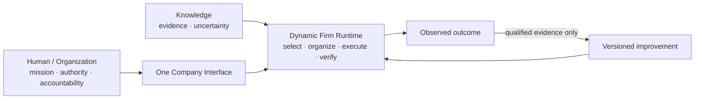

# 00 — North Star

## 우리가 만드는 것

Noruct는 전통적인 회사의 유용한 운영 원리를 AI runtime에 적용합니다. 사용자는 여러 agent를 조립하거나
workflow를 설계하는 대신, 하나의 회사 인터페이스에 목표를 전달합니다. 회사는 현재 목표에 필요한 최소 실행
구조를 만들고, 근거와 결과를 통합해 보고합니다.

## 회사라는 말의 의미

회사는 UI 테마나 사람의 조직도를 흉내 내는 역할극이 아닙니다. Noruct가 가져오는 것은 다음입니다.

- 지속되는 identity, policy, capability와 audit
- 목표별로 달라지는 최소 실행 구조
- 판단·실행·권한·검증의 명확한 분리
- 결과와 실제 outcome을 구분하는 기록
- 검증된 변화만 남기는 장기 적응

반대로 기본 구조에서 제외하는 것은 부서 놀이, 불필요한 직급, 모든 결과마다 열리는 회의, 이름만 다른 agent
clone, 무제한 자율 실행입니다.

## 핵심 명제

> Job 실행 구조의 권위는 Job이 끝날 때 만료되고, 검증된 조직 능력만 지속 상태에 반영된다.

이 명제는 두 가지 문제를 함께 막습니다. 모든 workflow를 영구 규칙으로 저장해 과거의 우연이 회사를 지배하는
문제와, 아무것도 축적하지 않아 매번 같은 실패를 반복하는 문제입니다.

## 사용자와 AI의 경계

Noruct는 조사, 분해, 실행, 검사, 기록, 개선 후보 생성을 자동화할 수 있습니다. 하지만 Mission, Authority,
Accountability는 사용자가 계속 소유합니다. 무엇을 원하는지, 어디까지 실행을 허용할지, 결과에 누가 책임질지는
모델이 대신 획득할 수 없는 권한입니다.

## 가변성

Dynamic Firm Runtime의 용어와 내부 모델은 교리가 아닙니다. 더 단순하고 강한 구조가 North Star를 더 잘
달성한다면 바뀔 수 있습니다. 다만 어떤 변화도 사용자 권한, 설명 가능성, 비용 경계와 검증된 개선이라는 원칙을
약화시키면 안 됩니다.
