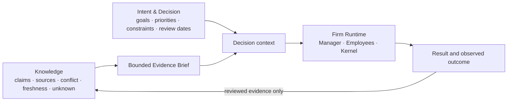

# 03 — Knowledge, Intent & Firm

Noruct는 지식 저장소와 실행 회사를 섞지 않습니다. 무엇을 아는지, 무엇을 원하는지, 지금 무엇을 실행할 수
있는지는 서로 다른 권한을 가진 세 plane입니다.

## Knowledge — What do we know?

Knowledge는 사용자가 가진 문서·근거·조사와 그 상태를 다룹니다. 중요한 것은 단순히 많은 문서를 context에 넣는
것이 아닙니다. claim, source, conflict, freshness, assumption과 unknown을 구분하고, 현재 task에 필요한 작은
Evidence Brief만 제공합니다.

Knowledge는 사용자 목표, 실행 권한 또는 최종 결정을 자동으로 만들지 않습니다.

## Intent & Decision — What do we want to do?

Intent & Decision은 목표, 우선순위, 제약, 결정, 보류, 책임자, 재검토 시점을 다룹니다. 예를 들어 자료는
“경쟁사가 가격을 올렸다”를 말할 수 있지만, 가격을 유지할지 바꿀지는 사용자·조직의 방향과 책임 문제입니다.

## Firm Runtime — What should we execute now?

Firm Runtime은 Manager, Employee와 Firm Kernel이 현재의 bounded task를 실행하는 plane입니다. Knowledge에서 필요한
근거를 받고 Intent의 제약을 존중하지만, 전체 지식이나 목표를 자기 권한으로 바꾸지 않습니다.

## 사용자 권한

사용자는 Mission, Authority, Accountability를 계속 소유합니다.

- 무엇을 우선할지와 어떤 trade-off를 받아들일지
- 어느 권한과 비용까지 허용할지
- 외부 약속, 비가역 action, 새로운 권한을 승인할지
- 결과를 현실의 성공으로 인정할지

Noruct는 명확하고 검증 가능하며 되돌릴 수 있는 영역에서는 자율 실행을 지향합니다. 가치 충돌, 불명확한 성공
기준, 큰 비용과 비가역 행동의 경계에서는 사용자의 판단을 대체하지 않습니다.
