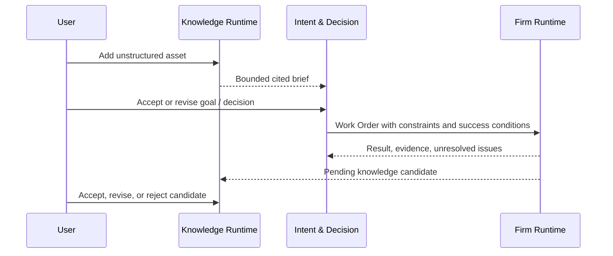
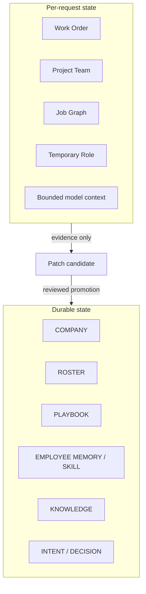

# Noruct System Architecture

## Product boundary

Noruct presents one persistent company interface. Users do not manually define agent count, role topology,
parallel branches, or a workflow canvas. A request is normalized into a bounded Work Order and admitted into
the smallest suitable execution form.

The product has four authority domains:

| Domain | Owns | Must not own |
|---|---|---|
| Company authority | purpose, policy, permissions, budgets, review posture | user knowledge bodies or model credentials |
| Knowledge Runtime | sources, claims, evidence, provenance, freshness | employee procedure or execution authority |
| Intent & Decision Plane | goals, constraints, decisions, deferrals, review dates | raw document corpus or tool grants |
| Firm Runtime | employees, task execution, verification, Job audit | silent durable learning or unrestricted knowledge writes |

## Three-plane contract

### 1. Knowledge Runtime

Answers: **What do we know?**

It stores user-owned source assets and structured knowledge without treating every extraction as truth.
Original assets, derived text/OCR/layout representations, claims, evidence, and freshness metadata remain
separate and versioned.

### 2. Intent & Decision Plane

Answers: **What do we want to do?**

It stores durable direction: goals, priorities, constraints, success conditions, open questions, decisions,
deferrals, owners, and review dates. It references compact Knowledge Briefs instead of copying the full corpus.

### 3. Firm Runtime

Answers: **What should we execute now?**

It chooses an employee or project team, builds a bounded plan only when necessary, exposes tools under a frozen
authority snapshot, reconciles results, and integrates one final response.

## Controlled bridges

No bridge grants automatic write authority. A Firm result is not immediately a fact, a Knowledge claim is not
automatically a Company instruction, and an Intent is not automatically an executable action.

## Durable and disposable state

Temporary specialists are Job-local and do not automatically receive durable identity, memory, or skill state.
Persistent employees may continue an explicitly retained session within their own namespace.

## Shared evolution boundary

The optional network manages versioned artifacts rather than a global mutable brain. Candidate skills, tools,
employee definitions, and playbooks require provenance, compatibility information, benchmark evidence, and a
rollback path. Users may pin a version, opt into latest-compatible updates, or remain fully local.

The network is not authorized to collect raw customer knowledge, private repository contents, credentials,
or unrestricted transcripts.
