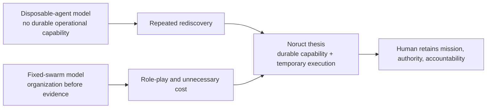

# 00 — North Star

> [Index](README.md) · [Next: Dynamic Firm Runtime →](01-dynamic-firm-runtime.md) · [한국어](../ko/00-north-star.md)

Noruct is building an AI system that behaves less like a chat window and more like a continuing company. A user should be able to state an outcome without manually drawing agent trees, assigning roles, or scripting a workflow.

The system's job is to choose the smallest reliable execution structure, retain only justified organizational learning, and leave the user in control of values and irreversible commitments.

> **Workflows are temporary. Organizational capability compounds.**

## Abstract

The problem is not merely how to make a model complete a longer task. It is how to preserve useful operational capability across tasks without turning every prior transcript, temporary plan, or model preference into a standing authority. Noruct proposes a persistent firm as the unit of continuity and a temporary work structure as the unit of execution.

## Problem statement

Most agent systems make one of two opposite mistakes. A single general agent carries too much unstructured context and repeats avoidable failures. A fixed multi-agent arrangement preserves roles but forces every request through an organization whether or not the work warrants it. Both approaches blur what is durable, what is task-specific, and who is allowed to decide.

## Research claim

Noruct advances the following design claim: **a runtime can improve the reliability of repeated work by preserving bounded, versioned organizational capability while letting request-specific execution structure expire.** This is a systems claim to be tested against quality, recoverability, cost, latency, and user control; it is not a claim that organization metaphors create intelligence by themselves.

## The company model

A company is useful here because it distinguishes what should persist from what should not:

- The firm's mission, operating limits, employees, skills, and proven playbooks persist.
- A project team, a task graph, intermediate notes, and a one-off execution plan usually do not.
- A request can be handled directly, by one employee, or by a temporary team. More agents are never the default measure of intelligence.

Noruct does not treat a company chart as a role-playing simulation. It uses the metaphor as an authority and state model: who may act, what evidence they require, what they may retain, and what can be changed later.

## What remains human-owned

AI can analyze alternatives and prepare action. It cannot legitimately own a user's values, external authority, or accountability. Noruct therefore keeps three things human-owned:

1. **Mission** — what outcome is worth pursuing.
2. **Authority** — which external commitments and state changes are allowed.
3. **Accountability** — who owns the consequences of a decision.

The firm can execute inside those boundaries. It should ask rather than silently crossing them.

## Evaluation implications

The concept should be judged by whether it reduces repeated operational failure without increasing silent autonomy. Useful measures include accepted outcome quality, correctionability after failure, explanation of structural choices, unnecessary delegation, budget adherence, and whether users can inspect or constrain consequential work. Faster output alone is insufficient evidence of a better firm.

## What Noruct is not

Noruct is not defined by a fixed organization chart, a permanent swarm, or a requirement to use multiple models. It is not a repository of chain-of-thought, and it is not an autonomous entity that can redefine a user's mission.

Its form may change as better operational structures become available. The invariant is simpler: durable capability should improve future work without silently taking over direction or authority.
