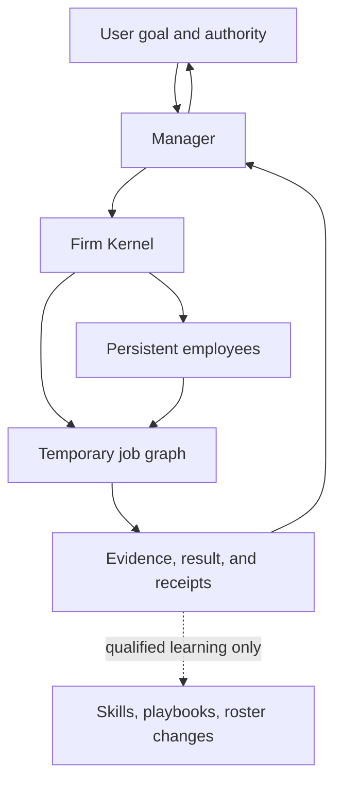

# 01 — Dynamic Firm Runtime

> [← North Star](00-north-star.md) · [Index](README.md) · [Next: Persistent Employee →](02-persistent-employee.md) · [한국어](../ko/01-dynamic-firm-runtime.md)

A Dynamic Firm Runtime is an execution system that maintains a firm over time while creating, reshaping, and retiring the smallest job structure required for each request.

## Four different things

| Concern | Purpose | Lifetime |
| --- | --- | --- |
| Company | Mission, policy, authority, budget, identity | Persistent |
| Employee | Capability, tools, approved memory, operating contract | Persistent or deliberately retired |
| Job graph | Dependencies, task ownership, execution order | Per request |
| Run record | Inputs, evidence, mutations, outputs, outcome | Durable audit record |

The job graph is not the company. It is a temporary work order placed inside the company.

## Direct, solo, or team execution

The runtime begins from the cheapest viable shape:

1. **Direct response** when no tool use, durable state, or independent verification is necessary.
2. **Solo execution** when one capable employee can own the work end to end.
3. **Temporary team execution** only when real dependency separation, capability separation, or independent verification creates enough value.

Parallelism is an outcome of dependency analysis. It is not a decorative feature.

## Manager and Kernel

The Manager reasons about meaning: whether a goal is clear, whether a specialist is needed, whether evidence is sufficient, and whether an escalation is justified. The Firm Kernel enforces mechanical rules: budgets, approvals, mutation limits, receipts, and state transitions.

This split prevents an LLM from becoming its own unbounded policy engine. A Manager can recommend a change; the Kernel decides whether the change is permissible.

## Runtime reshaping

Plans are hypotheses, not promises. As evidence arrives, a job can be retried, rerouted, extended with a diagnostic probe, joined into a final synthesis, or canceled. Every material revision should retain the prior structure, the reason for change, and the observed result.

The runtime should not create a meeting loop around ordinary work. A semantic decision boundary—not a calendar-shaped ritual—is what justifies Manager attention.
