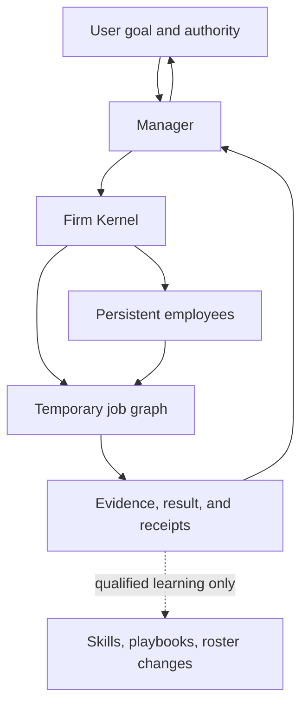
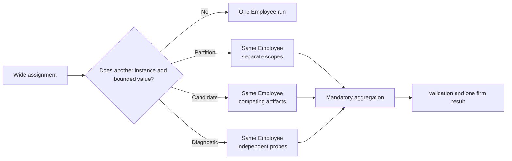

# 01 — Dynamic Firm Runtime

> [← North Star](00-north-star.md) · [Index](README.md) · [Next: Persistent Employee →](02-persistent-employee.md) · [한국어](../ko/01-dynamic-firm-runtime.md)

A Dynamic Firm Runtime is an execution system that maintains a firm over time while creating, reshaping, and retiring the smallest job structure required for each request.

## Four different things

| Concern | Purpose | Lifetime |
| --- | --- | --- |
| Company | Mission, policy, authority, budget, identity | Persistent |
| Employee | Capability, tools, approved memory, operating contract | Persistent or deliberately retired |
| Job graph | Dependencies, task ownership, execution order | Per request |
| Run record | Inputs, evidence, mutations, outputs, outcome | Durable audit record |

The job graph is not the company. It is a temporary work order placed inside the company.

## Direct, solo, or team execution

The runtime begins from the smallest shape that can protect the accepted outcome:

1. **Direct response** when no tool use, durable state, or independent verification is necessary.
2. **Solo execution** when one capable employee can own the work end to end.
3. **Temporary team execution** when real dependency separation, capability separation, independent verification, or a bounded replica-value opportunity creates enough value.

Parallelism is an outcome of dependency and marginal-value analysis. It is not a decorative feature, but minimizing spend is not allowed to silently lower expected result quality either.

A broad assignment does not always require several different Employees. The runtime may create two to four job-local execution instances of one selected Employee when the work has independent partitions, materially different candidate paths, or bounded diagnostic probes. The Employee remains one persistent capability identity; the instances receive frozen assignments and lose authority when the job ends.

This is execution replication, not roster growth. It does not create independent expertise, permission, memory, or judgment merely by multiplying instances. If diversity or independent verification is required, the graph must select a materially different capability or validation method.

For managed work, the planning preference is **performance-first**. The Manager actively considers a small replica group for broad partitions, valuable alternatives, and unclear failure causes. “One run can probably finish” is not by itself a rejection criterion; sufficiency is judged against expected accepted quality, coverage, diagnostic recovery, and useful latency under the existing hard ceiling. A user can explicitly request single/no-parallel execution, and neither preference increases permissions or budget.

## Manager and Kernel

The Manager reasons about meaning: whether a goal is clear, whether a specialist is needed, whether evidence is sufficient, and whether an escalation is justified. The Firm Kernel enforces mechanical rules: budgets, approvals, mutation limits, receipts, and state transitions.

This split prevents an LLM from becoming its own unbounded policy engine. A Manager can recommend a change; the Kernel decides whether the change is permissible.

## Runtime reshaping

Plans are hypotheses, not promises. As evidence arrives, a job can be retried, rerouted, extended with a diagnostic probe, joined into a final synthesis, or canceled. Every material revision should retain the prior structure, the reason for change, and the observed result.

The runtime should not create a meeting loop around ordinary work. A semantic decision boundary—not a calendar-shaped ritual—is what justifies Manager attention.

Users do not need to design this structure before asking for work. They can nevertheless inspect the generated graph, revise a versioned Blueprint, pin an accepted structure, or require approval before structural changes. Automatic composition and user control are complementary, not mutually exclusive.
