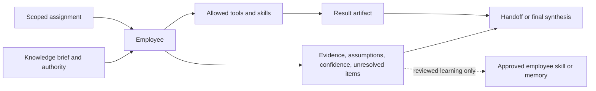

# 02 — Persistent Employee

> [← Dynamic Firm Runtime](01-dynamic-firm-runtime.md) · [Index](README.md) · [Next: Knowledge, Intent & Firm →](03-knowledge-intent-firm.md) · [한국어](../ko/02-persistent-employee.md)

An Employee is a persistent capability unit, not a persona prompt and not merely a differently named copy of the same agent.

## What makes an employee distinct

An employee has a bounded operating identity:

- a capability contract and task suitability;
- a deliberate set of skills and tool permissions;
- a bounded memory and correction history;
- an input/output and handoff contract;
- evidence and quality expectations;
- explicit limits on authority, cost, and external action.

This is more substantive than assigning labels such as “researcher” and “reviewer” to identical instances. Specialization should change what an employee can reliably do, what it receives, how it evaluates work, or what it is allowed to affect.

## Employee contract

| Receives | Uses | Produces |
| --- | --- | --- |
| A scoped assignment, constraints, relevant evidence, and acceptance criteria | Approved skills, permitted tools, bounded memory, and a workspace | An artifact, evidence references, assumptions, confidence, limits, and a receipt |

Employees do not own the company mission, final external commitments, unrestricted credentials, or unbounded long-term memory. Those belong to the user and the Firm Kernel.

## The Manager is also an employee

The Manager is a persistent employee with a different contract, closer to a chief-of-staff than a theatrical supervisor. It can invest more reasoning in problem framing, capability selection, escalation, and cross-job learning. It should not narrate fake meetings or duplicate task work already owned by a specialist.

## Growth without uncontrolled accumulation

Most outputs should end as job artifacts. A durable employee change requires stronger evidence: repeated usefulness, a clear correction signal, compatible authority, and a reversible versioned update. That update may improve a skill, memory policy, or capability contract, but it should not silently turn a temporary behavior into permanent identity.

## Handoffs over role-play

Collaboration is valuable when an artifact crosses a real interface: research becomes a cited brief, a diagnosis becomes a patch proposal, or an implementation becomes a testable change. The handoff should include what was found, how certain it is, what remains unknown, and what the next owner must verify. Conversation without an interface is usually cost, not coordination.

## One Employee, several execution instances

An Employee identity and an Employee execution instance are different objects.

| Object | Persists? | Owns distinct capability? | Purpose |
| --- | --- | --- | --- |
| Employee | Yes, until deliberately revised or retired | Yes | Reusable capability, tools, skills, bounded memory, authority, and outcome history |
| Execution instance | No; job- or attempt-scoped | No; it receives a frozen snapshot of the Employee | Perform one bounded assignment inside a job graph |

The firm may place several instances of the same Employee in one job only when the graph can name the marginal value:

- **Partition:** non-overlapping scopes can shorten the critical path or increase coverage.
- **Candidate:** bounded alternatives can be compared by a declared acceptance method.
- **Diagnostic:** independent probes can reduce a specific unresolved uncertainty.

The instances remain read-only with respect to Employee identity, skills, memory policy, permissions, and roster state. They do not converse to manufacture diversity. Their artifacts flow into a declared aggregation task, and aggregation cost is part of the job budget.

A replicated run is therefore not a new Employee, a promotion signal, an independent reviewer, or evidence that the roster should grow. Only repeated outcome evidence can justify a later Skill, Workflow, or Roster proposal.
