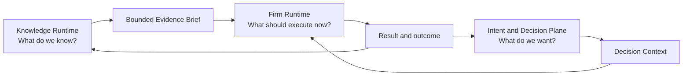

# 03 — Knowledge, Intent & Firm

> [← Persistent Employee](02-persistent-employee.md) · [Index](README.md) · [Next: Graph & Firm Engineering →](04-graph-and-firm-engineering.md) · [한국어](../ko/03-knowledge-intent-firm.md)

Noruct separates a user's external knowledge base from the user's direction and from the firm's execution machinery. Combining them into one ever-growing prompt creates confusion, stale assumptions, and accidental authority.

## Knowledge Runtime — what do we know?

This plane is the user's external knowledge tank. It can begin with raw material: PDFs, documents, notes, images, files, links, and future imports. Raw material remains source material; it is not copied wholesale into every task.

The runtime derives bounded, attributable knowledge artifacts such as extracted facts, evidence references, contradictions, freshness signals, and concise research briefs. It preserves the difference between what a source says and what the system infers from it.

## Intent and Decision Plane — what do we want?

This plane holds durable direction rather than source archives: goals, priorities, constraints, open questions, decisions, decisions on hold, owners, review dates, and success conditions. It may reference a short knowledge brief, but it must not impersonate the full evidence base.

This separation makes it possible to say: “we have evidence,” “we have chosen a direction,” and “we have not decided yet” without turning any of them into the others.

## Firm Runtime — what should execute now?

The Firm Runtime receives a bounded question, decision context, authority, and acceptance criteria. It chooses an execution shape, produces a result, and returns evidence and receipts. A result is not automatically treated as knowledge or policy; it becomes a candidate for review in the appropriate plane.

## The bridge is explicit

Examples of the intended behavior:

- “Put this PDF into our pricing knowledge.”
- “Turn the evidence into questions for the next pricing decision.”
- “Revisit that decision in August.”
- “When the review date arrives, commission only the research needed.”

The bridge prevents a passive archive from becoming a forgotten folder and prevents the executing firm from treating every stored file as a standing instruction.
