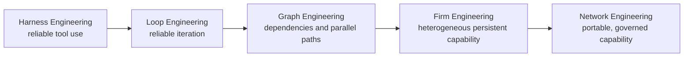

# 04 — Graph & Firm Engineering

> [← Knowledge, Intent & Firm](03-knowledge-intent-firm.md) · [Index](README.md) · [Next: Governed Evolution & User Graphs →](05-governed-evolution-and-user-graphs.md) · [한국어](../ko/04-graph-and-firm-engineering.md)

Graph Engineering is not a visual graph product and not simply spawning several copies of one agent. It is the design of a dependency-aware execution structure. Firm Engineering extends it by making nodes persistent, heterogeneous capability units governed by one firm's authority and learning boundaries.

## Why ordinary multi-agent graphs underperform

If every node uses the same tools, permissions, skills, model assumptions, and evaluation method, changing node names does not create meaningful independence. It often creates correlated error, role-play overhead, duplicated research, and false verification.

Firm Engineering asks a harder question for each node: what distinct capability, authority boundary, input contract, or verification method does this node contribute?

## A graph earns its complexity

The runtime adds a node only when one of these is true:

- work can proceed independently and a shorter critical path matters;
- a distinct capability or tool boundary is genuinely required;
- a diagnostic probe can reduce an otherwise unresolved uncertainty;
- an independent verification method materially changes confidence;
- a user-requested graph template has a valid operating purpose.

Otherwise, the correct graph is one node or no job graph at all.

## Manager attention is scarce

The Manager does not review every token or simulate conversations between employees. It intervenes at semantic boundaries: ambiguous goals, conflicting evidence, missing capability, authority escalation, a major graph revision, or a meaningful learning proposal.

This turns the Manager into a decision and routing capability rather than a permanent bottleneck.

## Evaluate the lower tail

A graph should be judged by more than average output quality. Its operating quality also includes failure predictability, cost, latency, correctionability, evidence quality, and the ability to explain why a particular structure was used. A design that is occasionally brilliant but often impossible to recover may be worse than a simpler, bounded path.
