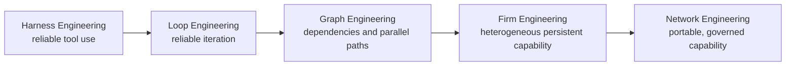
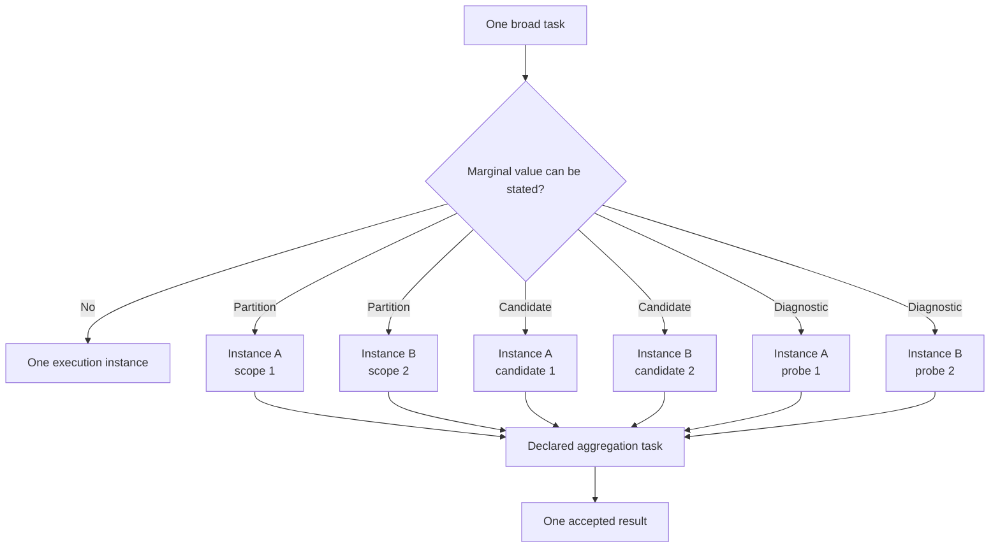

# 04 — Graph & Firm Engineering

> [← Knowledge, Intent & Firm](03-knowledge-intent-firm.md) · [Index](README.md) · [Next: Governed Evolution & User Graphs →](05-governed-evolution-and-user-graphs.md) · [한국어](../ko/04-graph-and-firm-engineering.md)

Graph Engineering is not a visual graph product and not simply spawning several copies of one agent. It is the design of a dependency-aware execution structure. Firm Engineering extends it by making nodes persistent, heterogeneous capability units governed by one firm's authority and learning boundaries.

## Why ordinary multi-agent graphs underperform

If every node uses the same tools, permissions, skills, model assumptions, and evaluation method, changing node names does not create meaningful independence. It often creates correlated error, role-play overhead, duplicated research, and false verification.

Firm Engineering asks a harder question for each node: what distinct capability, authority boundary, input contract, or verification method does this node contribute?

## A graph earns its complexity

The runtime adds a node only when one of these is true:

- work can proceed independently and a shorter critical path matters;
- a distinct capability or tool boundary is genuinely required;
- a diagnostic probe can reduce an otherwise unresolved uncertainty;
- an independent verification method materially changes confidence;
- a user-requested graph template has a valid operating purpose.

Otherwise, the correct graph is one node or no job graph at all.

## Homogeneous execution can still have bounded value

Different nodes do not always need different Employee profiles. A single selected Employee may be instantiated more than once when the assignment itself contains safe parallel structure. This is a narrow execution optimization, not the source of Firm-level diversity.

The guardrails are structural:

- two to four run-only instances from one frozen Employee capability snapshot;
- non-overlapping partition scopes or explicitly comparable candidates or probes;
- the same authority and hard job budget, not a hidden budget multiplier;
- no instance may mutate the Employee, roster, Blueprint, or Playbook;
- all members must converge through a declared aggregation task;
- a distinct reviewer must use a materially different validator or capability, not merely another copy.

## Performance-first planning, hard-capped execution

Managed jobs default to a performance-first proposal posture. The Manager and Compiler actively test a two-to-four-run replica hypothesis when the work has disjoint breadth, multiple candidates worth comparing, or an unclear cause that benefits from separate probes. A single run being technically capable of finishing is not enough to reject that hypothesis.

The hard budget remains a ceiling, not a spending target. The preferred proposal is the smallest two- or three-run group that captures a concrete quality, coverage, recovery, or latency gain; a fourth run needs an explicit scope or candidate-set reason. If exact safe scopes and aggregation cannot be stated, the provider fails, the Kernel rejects admission, or the user requests single/no-parallel execution, the graph stays solo. Proposal can be aggressive while authority admission remains strict.

## Prove value under the same total budget

Replica count is not a success metric. A fair evaluation compares a single-instance run and a replicated run on the same workload, environment, Employee capability revision, and total hard budget. Aggregation overhead counts against the replicated run.

The comparison observes accepted quality, coverage, complete failure, safety and validation regressions, latency, and total resource usage. One attractive result is not enough. A reusable recommendation needs repeated paired evidence across distinct workloads, while any safety or validation regression is a reason to stop or roll back the candidate structure.

The evaluator produces evidence and a recommendation. It does not silently edit a Blueprint or promote a Playbook. That preserves the distinction between measuring an execution shape and granting it organizational authority.

## Manager attention is scarce

The Manager does not review every token or simulate conversations between employees. It intervenes at semantic boundaries: ambiguous goals, conflicting evidence, missing capability, authority escalation, a major graph revision, or a meaningful learning proposal.

This turns the Manager into a decision and routing capability rather than a permanent bottleneck.

## Evaluate the lower tail

A graph should be judged by more than average output quality. Its operating quality also includes failure predictability, cost, latency, correctionability, evidence quality, and the ability to explain why a particular structure was used. A design that is occasionally brilliant but often impossible to recover may be worse than a simpler, bounded path.
