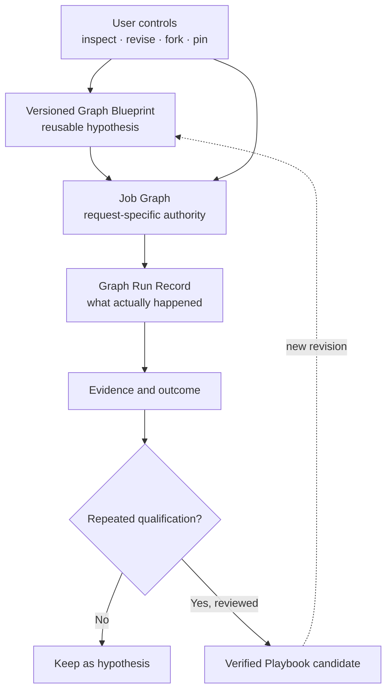

# 05 — Governed Evolution & User Graphs

> [← Graph & Firm Engineering](04-graph-and-firm-engineering.md) · [Index](README.md) · [Next: Epistemic Control, Oracle & Outcome →](06-epistemic-control-and-outcome.md) · [한국어](../ko/05-governed-evolution-and-user-graphs.md)

Noruct does not assume the runtime can always discover the best graph from scratch. Users may inspect, constrain, choose, fork, pin, or share reusable graph blueprints. The system may still compile a job-specific graph, but it must make changes legible and bounded.

## Three records, not one mutable graph

- **Blueprint:** a reusable template with intended roles, constraints, and version.
- **Job graph:** the concrete task and dependency graph for one work order.
- **Run record:** an append-only account of the graph that actually executed, including revisions and receipts.

This distinction makes experimentation possible without rewriting history.

## User control modes

| Mode | Runtime behavior |
| --- | --- |
| Locked | Follow the declared structure; request a change when it becomes inadequate. |
| Propose | Suggest structural changes with reason, cost, and expected benefit. |
| Bounded automatic | Apply only pre-authorized, reversible changes inside stated limits. |

Graphs are interfaces, not just hidden compiler output. A future CLI, TUI, or GUI can expose the same blueprint, revision, and approval concepts without creating a different authority model.

## A Blueprint can express execution replication

A versioned Blueprint may state that one Employee should receive several job-local execution assignments. The declaration must include the strategy, each bounded scope, the aggregation task, and the expected marginal value. This makes the structure inspectable and editable instead of leaving it as an invisible compiler trick.

The declaration remains a hypothesis. It does not mean the Employee was cloned into several durable identities, and it does not prove the structure is efficient. Users can revise, remove, lock, fork, or pin the proposal through the same Blueprint revision model used for other graph choices.

Automatic proposal and durable reuse have different thresholds. A performance-first Manager may propose a bounded replica group early when the current work exposes a clear partition, candidate, or diagnostic opportunity. That does not make the pattern a verified organizational asset: only later paired outcomes can qualify it for reusable recommendation, and the qualification still cannot rewrite authority on its own.

## Qualification does not rewrite authority

Before a replicated structure becomes a reusable recommendation, it should be compared with a single-run baseline under identical workload, environment, Employee capability, and total hard budget. The evidence set must include aggregation overhead and outcome measures rather than counting how many instances completed.

A single pair can reveal a useful signal or a regression, but it is insufficient for promotion. The initial qualification rule requires at least three paired trials on distinct workloads and value signals in at least two thirds of them; safety, validation, or material quality regressions fail fast. Even a positive qualification result is advisory: changing a pinned Blueprint or promoting a Playbook remains an explicit, versioned, reviewable act.

## Evidence-gated evolution

Most runs should leave no persistent behavioral change. Meaningful events can create a versioned proposal in one of three places:

1. **Skill Patch** — improve an employee's procedure or specialized knowledge.
2. **Workflow Patch** — improve a decomposition, dependency pattern, ordering, or verification placement.
3. **Roster Patch** — create, merge, retire, or change the authority of an employee capability.

Each proposal needs provenance, a reason, compatibility checks, and rollback. A temporary specialist is cheap to create for one job; becoming a durable employee is a much higher bar.

## Revision is an auditable decision

When a graph changes, the firm should retain the prior revision, the triggering evidence, the actor or policy that approved it, reserved and spent budget, and the observed effect on quality, cost, and delay. This is the price of letting a workflow adapt without making its result impossible to explain.
