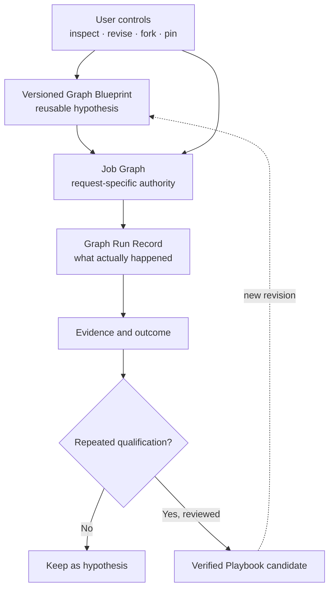
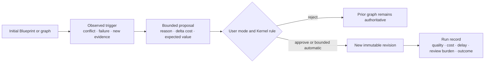

# 05 — Governed Evolution & User Graphs

> [← Graph & Firm Engineering](04-graph-and-firm-engineering.md) · [Index](README.md) · [Next: Epistemic Control, Oracle & Outcome →](06-epistemic-control-and-outcome.md) · [한국어](../ko/05-governed-evolution-and-user-graphs.md)

Noruct does not assume the runtime can always discover the best graph from scratch. Users may inspect, constrain, choose, fork, pin, or share reusable graph blueprints. The system may still compile a job-specific graph, but it must make changes legible and bounded.

## Abstract

This paper treats a graph as a user-visible, versioned hypothesis rather than a hidden compiler artifact. The key design problem is to preserve adaptive execution without making cost, causality, or user control disappear when a graph changes during a job.

## Three records, not one mutable graph

- **Blueprint:** a reusable template with intended roles, constraints, and version.
- **Job graph:** the concrete task and dependency graph for one work order.
- **Run record:** an append-only account of the graph that actually executed, including revisions and receipts.

This distinction makes experimentation possible without rewriting history.

## User control modes

| Mode | Runtime behavior |
| --- | --- |
| Locked | Follow the declared structure; request a change when it becomes inadequate. |
| Propose | Suggest structural changes with reason, cost, and expected benefit. |
| Bounded automatic | Apply only pre-authorized, reversible changes inside stated limits. |

Graphs are interfaces, not just hidden compiler output. A future CLI, TUI, or GUI can expose the same blueprint, revision, and approval concepts without creating a different authority model.

## Conservative recursive improvement

External Tools, Skills, Plugins, and Network artifacts remain pinned to an exact version and digest and are never
replaced automatically. Staging, review, installation, and activation of an external package are separate explicit
local decisions. Noruct has no path that edits the imported package source.

Only when the user selects `always-approve` may a locally derived artifact with no Network provenance advance
automatically for a future Job. Before activation, the candidate must remain inside the existing local authority and
pass a static shadow compatibility check requiring the same runtime contract and required-capability contract as the
active version. This is a compatibility boundary, not evidence of semantic or performance superiority.

A running Job remains pinned to the artifact revision selected at admission. A new activation affects later Jobs only,
and the prior activation remains available as a rollback target.

## Development position

The current local development path already exposes Blueprint catalog, preview, structured revision, fork, pin, user
constraints, and retained run-lineage through terminal surfaces. A proposed live revision can pause a Job and is only
continued after an exact approval or rejection receipt is checked against the same frozen Work Order, prior graph, and
lease. This is deliberately narrower than general checkpoint replay: failed, in-flight, and effectful work is not
silently resumed.

Desktop and web control surfaces are still a future projection, and causal attribution of a graph revision's actual
quality, cost, or latency effect remains an evaluation problem rather than a completed product claim.

## A Blueprint can express execution replication

A versioned Blueprint may state that one Employee should receive several job-local execution assignments. The declaration must include the strategy, each bounded scope, the aggregation task, and the expected marginal value. This makes the structure inspectable and editable instead of leaving it as an invisible compiler trick.

The declaration remains a hypothesis. It does not mean the Employee was cloned into several durable identities, and it does not prove the structure is efficient. Users can revise, remove, lock, fork, or pin the proposal through the same Blueprint revision model used for other graph choices.

Automatic proposal and durable reuse have different thresholds. A minimum-sufficient Manager may propose a bounded replica group when the current work exposes an exact partition, candidate comparison, diagnostic probe, or other material value that direct or solo execution cannot preserve as well. Unknown value keeps the Job solo. Even an admitted proposal is only a Job-local hypothesis: later matched evidence is required before it can become a reusable recommendation, and qualification still cannot rewrite authority on its own.

## Qualification does not rewrite authority

Before a replicated structure becomes a reusable recommendation, it should be compared with a single-run baseline under identical workload, environment, Employee capability, and total hard budget. The evidence set must include aggregation overhead and outcome measures rather than counting how many instances completed.

A single matched pair can support `OBSERVE_ONLY` or `EXPERIMENT_ELIGIBLE`, or reveal a regression, but it cannot establish automatic reuse. `AUTO_REUSE_ELIGIBLE` requires a predefined gate for the exact matched context. That gate must examine lower-tail quality, complete and safety failure, validation regression, and total cost including communication, coordination, integration, verification, and human review burden. A sample count or favorable majority is never sufficient by itself. Even a positive result is advisory: changing a pinned Blueprint or promoting a Playbook remains an explicit, versioned, reviewable act.

## Evidence-gated evolution

Most runs should leave no persistent behavioral change. Meaningful events can create a versioned proposal in one of three places:

1. **Skill Patch** — improve an employee's procedure or specialized knowledge.
2. **Workflow Patch** — improve a decomposition, dependency pattern, ordering, or verification placement.
3. **Roster Patch** — create, merge, retire, or change the authority of an employee capability.

Each proposal needs provenance, a reason, compatibility checks, and rollback. A temporary specialist is cheap to create for one job; becoming a durable employee is a much higher bar.

## Revision is an auditable decision

When a graph changes, the firm should retain the prior revision, the triggering evidence, the actor or policy that approved it, reserved and spent budget, and the observed effect on quality, cost, delay, and human review burden. The terminal delivery should explain the change and the material alternative it excluded without requiring a raw event replay. This is the price of letting a workflow adapt without making its result impossible to explain.

## Causal record for a structural change

The public principle is not that every graph must mutate. It is that any material mutation must be reconstructible as a decision with a reason and a bounded effect.
