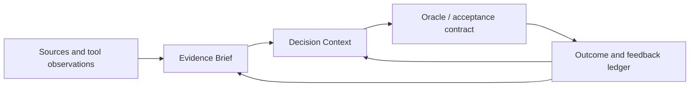

# 06 — Epistemic Control, Oracle & Outcome

> [← Governed Evolution & User Graphs](05-governed-evolution-and-user-graphs.md) · [Index](README.md) · [Next: Network Engineering →](07-network-engineering.md) · [한국어](../ko/06-epistemic-control-and-outcome.md)

The central limitation of an AI firm is not that it cannot generate ideas. It is that it often cannot independently establish what is true, what should be valued, or whether a long chain of action genuinely succeeded.

## Epistemic status is first-class

Noruct should distinguish at least these states:

| Status | Meaning |
| --- | --- |
| Observed | Directly supported by a source or tool result. |
| Inferred | Reasoned from available evidence. |
| Assumed | Used provisionally because evidence is incomplete. |
| Decided | Chosen by an authorized owner. |
| Disputed | Contradicted or contested. |
| Stale | May no longer describe the current world. |
| Unknown | Not established. |

An answer that hides these distinctions is more dangerous than an answer that admits uncertainty.

## Four control artifacts

- **Evidence Brief:** bounded claims, sources, freshness, contradictions, and uncertainty.
- **Decision Context:** the goal, constraints, owner, alternatives, and review date.
- **Oracle / acceptance contract:** what can be checked, by which method, and who accepts residual uncertainty.
- **Outcome and feedback ledger:** what happened after the decision or action, including corrections and delayed signals.

## What knowledge can help with—and cannot replace

A strong knowledge runtime can reduce missing context, preserve source provenance, surface contradictions, and remind the firm of prior decisions. It cannot create an objective answer for value conflicts, grant authority to make a legal or irreversible commitment, or guarantee independent verification when the same assumptions shape both execution and review.

For high-impact actions, Noruct should prefer deterministic tests, external data checks, sandboxed trials, independent evaluation methods, or explicit human acceptance. The right response to an absent oracle is often to narrow the claim or escalate—not to generate a more confident paragraph.

## Outcome is part of learning

The firm should separate “the output looked good” from “the action produced the intended effect.” Delayed feedback, user correction, real-world metrics, and failed acceptance should influence future recommendations. They should not be converted blindly into a permanent skill or policy without attribution and review.
