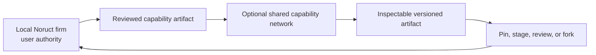

# 07 — Network Engineering

> [← Epistemic Control, Oracle & Outcome](06-epistemic-control-and-outcome.md) · [Index](README.md) · [한국어](../ko/07-network-engineering.md)

Network Engineering is the optional layer above one local firm. It allows reusable capability to travel between firms without making a remote network the authority over a user's knowledge, mission, credentials, or active work.

## What can travel

The useful unit of sharing is a governed, versioned artifact: a skill package, a tool adapter definition, an employee capability contract, a graph blueprint, a benchmark, a verification recipe, or a compatibility record. Each artifact should expose provenance, declared permissions, version, evaluation evidence, and rollback path.

## What must remain local

Raw user files, private knowledge stores, credentials, active job state, private conversations, sensitive receipts, and unstated organizational context are not capability artifacts. A network must never treat them as the price of participation.

## Adoption is a local decision

The safe default is no automatic import and no automatic activation. A user or local policy can inspect an artifact, compare versions, pin a known version, stage it in a bounded environment, accept or reject it, and roll it back later. “Always latest” is a user-selectable update policy, not a network right.

## Why a network matters

Open local code alone does not make every firm equally capable. Shared, tested, attributable operational knowledge can improve the floor of the ecosystem—provided that contributors and adopters retain control over what leaves their environment and what becomes active inside it.

Network Engineering therefore extends Firm Engineering without replacing it: the local firm remains the state authority; the network is a governed source of optional capability.
