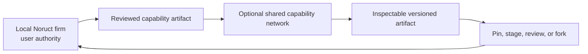
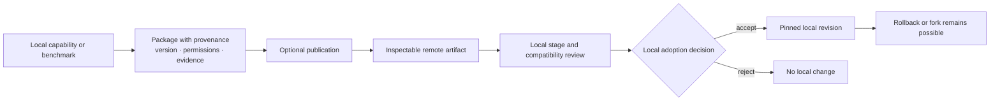

# 07 — Network Engineering

> [← Epistemic Control, Oracle & Outcome](06-epistemic-control-and-outcome.md) · [Index](README.md) · [한국어](../ko/07-network-engineering.md)

Network Engineering is the optional layer above one local firm. It allows reusable capability to travel between firms without making a remote network the authority over a user's knowledge, mission, credentials, or active work.

## Abstract

This paper defines a local-first model for shared improvement. A network may distribute inspectable capability artifacts, but it must not turn contribution into a requirement to surrender private context or turn publication into remote execution authority.

## What can travel

The useful unit of sharing is a governed, versioned artifact: a skill package, a tool adapter definition, an employee capability contract, a graph blueprint, a benchmark, a verification recipe, or a compatibility record. Each artifact should expose provenance, declared permissions, version, evaluation evidence, and rollback path.

## What must remain local

Raw user files, private knowledge stores, credentials, active job state, private conversations, sensitive receipts, and unstated organizational context are not capability artifacts. A network must never treat them as the price of participation.

## Adoption is a local decision

The safe default is no automatic import and no automatic activation. A user or local policy can inspect an artifact,
compare versions, pin a known version, stage it in a bounded environment, accept or reject it, and roll it back later.
External Tools, Skills, Plugins, and Network artifacts do not support an “always latest” automatic replacement policy.
Each new external version and digest must be reviewed and activated explicitly.

This boundary is separate from local recursive improvement. Even when the user selects `always-approve`, automatic
advancement is limited to locally derived artifacts with no Network provenance. A candidate must pass authority checks
and a static shadow compatibility check for the same runtime and required-capability contracts before it can affect a
future Job. Running-Job pins, prior activation rollback, and the imported package source remain unchanged.

## Artifact lifecycle

The critical distinction is between **availability** and **authority**. A network can make an artifact available; only a local user or local policy can make it active.

## Development position

The current development implementation includes a signed, versioned Artifact lifecycle: discover, verify, stage,
review, install, activate for future work, pin, and roll back. It supports first-party, community, and private-team
source classes while keeping credentials outside the local artifact catalog. A deployed read-only registry endpoint is
used only as an availability surface; it cannot change a local Company or a running Job.

The presently published first-party artifact is deliberately synthetic and experimental. It demonstrates the
distribution path, not a customer-ready marketplace or an automatic update channel. Customer self-service, consent
operations, broad executable adapters, and production qualification remain outside the current claim.

## Why a network matters

Open local code alone does not make every firm equally capable. Shared, tested, attributable operational knowledge can improve the floor of the ecosystem—provided that contributors and adopters retain control over what leaves their environment and what becomes active inside it.

Network Engineering therefore extends Firm Engineering without replacing it: the local firm remains the state authority; the network is a governed source of optional capability.
