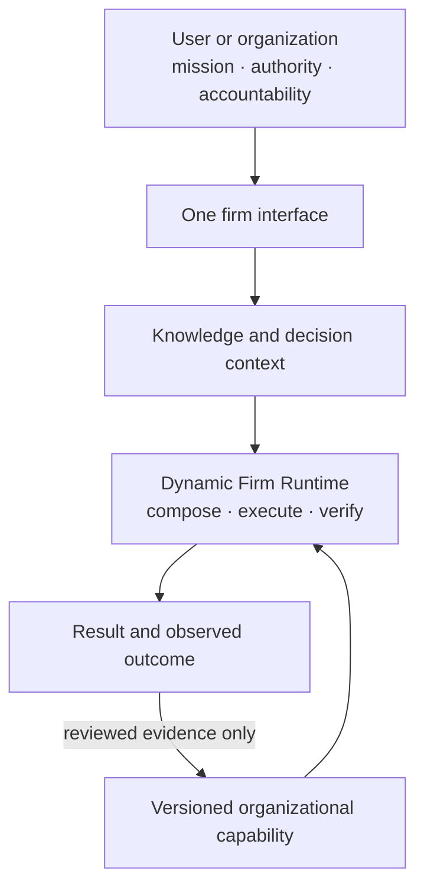

# Noruct: a concept paper series

> **Canonical language:** English · [한국어 번역](../ko/README.md)

## Abstract

Noruct is not a collection of disposable agents. It is a concept for a persistent firm runtime: a system that turns a user's goals, knowledge, decisions, and execution authority into governed work while retaining only the organizational capability justified by evidence. The series explains a product thesis, not an implementation manual or a claim that every optional capability is active in every environment.

## Central thesis

> **Workflows are temporary. Organizational capability compounds.**

The thesis has three parts. A user should not need to draw an agent tree before receiving useful work. A runtime should not mistake a temporary task plan for durable organizational knowledge. And no amount of model capability gives a system the right to own the user's values, irreversible authority, or accountability.

Its operating consequence is a **minimum sufficient organization**: direct or strong solo execution remains the
baseline when added value is unknown, while every additional Employee, execution instance, Manager step, or reviewer
must name its material contribution and integration boundary. The result should end in a short, reviewable delivery,
not require a person to reconstruct the conclusion from raw logs.

## How to read this series

The documents move from purpose to operating model, then from execution to knowledge, control, and optional networked reuse. They intentionally distinguish a **claim** (what the concept proposes), a **mechanism** (how the concept would preserve that claim), and a **boundary** (what the mechanism must not be mistaken for).

| # | Document | Core question | Contribution to the argument |
| --- | --- | --- |
| 00 | [North Star](00-north-star.md) | What is Noruct trying to become? | Defines the human boundary and persistence thesis. |
| 01 | [Dynamic Firm Runtime](01-dynamic-firm-runtime.md) | How does a firm execute a request? | Defines Company, Manager, Kernel, Employee, graph, and audit. |
| 02 | [Persistent Employee](02-persistent-employee.md) | What makes an employee more than a role prompt? | Defines heterogeneous capability and private bounded state. |
| 03 | [Knowledge, Intent & Firm](03-knowledge-intent-firm.md) | How do knowledge, direction, and action stay separate? | Prevents archives, decisions, and execution from becoming one authority. |
| 04 | [Graph & Firm Engineering](04-graph-and-firm-engineering.md) | Why is this not ordinary multi-agent orchestration? | Explains when a graph earns its cost. |
| 05 | [Governed Evolution & User Graphs](05-governed-evolution-and-user-graphs.md) | How can workflows evolve without becoming opaque? | Separates reusable hypotheses from job authority and learning. |
| 06 | [Epistemic Control, Oracle & Outcome](06-epistemic-control-and-outcome.md) | What can the firm know, decide, and safely verify? | Makes uncertainty and delayed outcomes first-class. |
| 07 | [Network Engineering](07-network-engineering.md) | How can reusable capability travel without taking user authority with it? | Defines optional, local-first capability exchange. |
| 08 | [Current Development Status](08-current-development-status.md) | Which parts are implemented, experimental, or not yet claimed? | Separates the concept paper from present development evidence. |
| 09 | [Organization as Decision Architecture](09-organization-as-decision-architecture.md) | What makes an agent workflow an organization, how small should it be, and what should it explain? | Separates task, assignment, information, communication, authority, verification, and learning; then defines minimum sufficient organization and reviewable delivery. |

Read in order for the full argument. Readers interested in one question can begin with the matching paper, but the claims about graph design depend on the Employee and authority model, and the claims about evolution depend on epistemic and outcome control.

## Public-document boundary

This repository publishes product concepts, operating boundaries, and architectural principles. It does not publish customer data, private development records, internal operational configuration, security-sensitive implementation detail, or a promise of autonomous authority.

The [status paper](08-current-development-status.md) is the only document in this series that summarizes present
development evidence. The other papers define intended architecture and product boundaries; they do not by themselves
claim that every described mechanism is generally available or commercially qualified.
