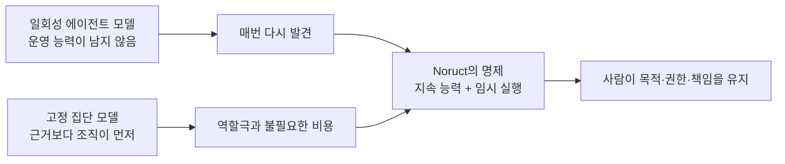
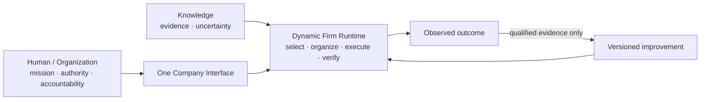

# 00 — North Star

> 정본: [English](../en/00-north-star.md) · [문서 인덱스](README.md) · [다음: Dynamic Firm Runtime →](01-dynamic-firm-runtime.md)

## 우리가 만드는 것

Noruct는 전통적인 회사의 유용한 운영 원리를 AI runtime에 적용합니다. 사용자는 여러 agent를 조립하거나
workflow를 설계하는 대신, 하나의 회사 인터페이스에 목표를 전달합니다. 회사는 현재 목표에 필요한 최소 실행
구조를 만들고, 근거와 결과를 통합해 보고합니다.

Noruct의 목표는 사용자의 목표를 대신 정하는 자율 기업이 되는 것이 아닙니다. 사용자가 정한 방향과 권한 안에서,
매번 새로 만들어지는 작업 흐름보다 더 오래 남는 **조직 능력**을 축적하는 것입니다.

## 초록

문제는 모델이 더 긴 작업을 끝낼 수 있는가에만 있지 않습니다. 이전 대화, 임시 계획, 한 번의 모델 선호가 모두
상시 권한이 되지 않게 하면서도, 반복 작업에 유용한 운영 능력을 어떻게 남길 것인가가 문제입니다. Noruct는
지속되는 회사를 연속성의 단위로, 임시 작업 구조를 실행의 단위로 둡니다.

## 문제 설정

많은 에이전트 시스템은 두 극단 중 하나에 머뭅니다. 단일 범용 에이전트는 구조화되지 않은 맥락을 너무 많이 안고
같은 실패를 다시 발견합니다. 고정 다중 에이전트 구조는 작업에 필요하지 않아도 조직을 먼저 강요합니다. 두 방식
모두 무엇이 오래 남고, 무엇이 작업 한정이며, 누가 결정 권한을 갖는지를 흐립니다.

## 연구 명제

Noruct의 설계 명제는 다음과 같습니다. **버전 관리되는 제한적 조직 능력을 남기고, 요청별 실행 구조는 만료시키면,
반복 작업의 신뢰성을 높일 수 있다.** 이는 회사 비유 자체가 지능을 만든다는 주장이 아닙니다. 결과 품질, 실패 후
복구 가능성, 비용, 지연, 사용자 통제로 검증해야 하는 시스템 가설입니다.

## 무엇을 하지 않는가

- agent 수가 많다는 사실을 지능의 증거로 취급하지 않습니다.
- 회사 조직도를 대화형 역할극으로 재현하지 않습니다.
- 사용자 가치, 계약 권한, 비가역적 약속을 AI가 소유한다고 가정하지 않습니다.
- 모든 실행 결과를 장기 기억이나 정책으로 자동 승격하지 않습니다.

## 회사라는 말의 의미

회사는 UI 테마나 사람의 조직도를 흉내 내는 역할극이 아닙니다. Noruct가 가져오는 것은 다음입니다.

- 지속되는 identity, policy, capability와 audit
- 목표별로 달라지는 최소 실행 구조
- 판단·실행·권한·검증의 명확한 분리
- 결과와 실제 outcome을 구분하는 기록
- 검증된 변화만 남기는 장기 적응

반대로 기본 구조에서 제외하는 것은 부서 놀이, 불필요한 직급, 모든 결과마다 열리는 회의, 이름만 다른 agent
clone, 무제한 자율 실행입니다.

## 핵심 명제

> Job 실행 구조의 권위는 Job이 끝날 때 만료되고, 검증된 조직 능력만 지속 상태에 반영된다.

이 명제는 두 가지 문제를 함께 막습니다. 모든 workflow를 영구 규칙으로 저장해 과거의 우연이 회사를 지배하는
문제와, 아무것도 축적하지 않아 매번 같은 실패를 반복하는 문제입니다.

## 사용자와 AI의 경계

Noruct는 조사, 분해, 실행, 검사, 기록, 개선 후보 생성을 자동화할 수 있습니다. 하지만 Mission, Authority,
Accountability는 사용자가 계속 소유합니다. 무엇을 원하는지, 어디까지 실행을 허용할지, 결과에 누가 책임질지는
모델이 대신 획득할 수 없는 권한입니다.

## 평가 기준

이 개념은 반복 실패를 줄이면서도 조용한 자율성을 늘리지 않는지로 평가해야 합니다. 승인된 결과의 품질, 실패 후
수정 가능성, 구조 선택의 설명성, 불필요한 위임, 예산 준수, 중요한 작업을 사용자가 검사·제한할 수 있는지가
핵심입니다. 더 빠른 출력만으로 더 나은 회사라고 볼 수는 없습니다.

## 가변성

Dynamic Firm Runtime의 용어와 내부 모델은 교리가 아닙니다. 더 단순하고 강한 구조가 North Star를 더 잘
달성한다면 바뀔 수 있습니다. 다만 어떤 변화도 사용자 권한, 설명 가능성, 비용 경계와 검증된 개선이라는 원칙을
약화시키면 안 됩니다.
