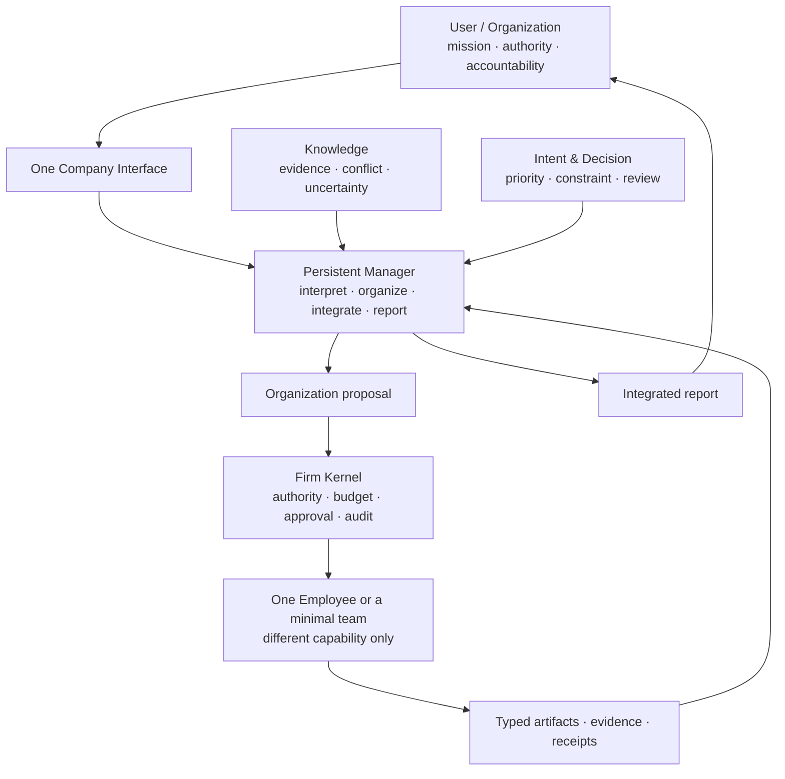
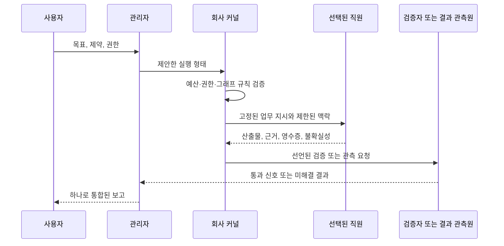
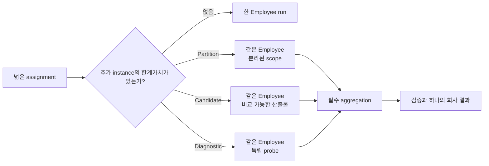

# 01 — Dynamic Firm Runtime

> 정본: [English](../en/01-dynamic-firm-runtime.md) · [← North Star](00-north-star.md) · [문서 인덱스](README.md) · [다음: Persistent Employee →](02-persistent-employee.md)

## 한 문장 정의

**Dynamic Firm Runtime**은 지속되는 회사 상태와 Employee를 바탕으로, 요청마다 필요한 최소 실행 구조를 만들고,
실행 결과와 검증된 근거에 따라 다음 작업의 능력을 개선하는 운영 모델입니다.

## 초록

이 문서는 회사 비유가 역할극이 아니라 실제 운영 구조가 되는 조건을 정의합니다. 회사는 권한과 능력의 경계로
지속되고, 작업 그래프는 하나의 업무 지시를 수행하기 위해서만 존재합니다. 관리자는 의미를 해석하고, 커널은 규칙을
강제합니다. 어느 하나도 다른 하나를 대신하지 않습니다.

## 현재 개발 위치

현재 개발 구현에는 하나의 로컬 Company 진입점, 지속 Company·Employee 상태, graph 없는 direct 작업, managed solo
작업, 제한된 team 작업이 있습니다. Work Order, capability snapshot, task receipt, graph revision, Patch proposal은
서로 다른 lifecycle로 기록됩니다.

이는 Manager가 이끄는 팀이 강한 단일 Employee보다 일반적으로 낫다는 주장이 아닙니다. 현재 평가는 positive와
negative transfer evidence를 모두 보존하며, 성공한 campaign 하나만으로 Manager·Blueprint·Patch를 자동 승격하지
않습니다. 구현 범위와 검증 한계는 [현재 개발 상태](08-current-development-status.md)에 정리합니다.

## 작동 가설

같은 사용자 목표라도 가장 좋은 실행 형태는 직접 응답, 단독 실행, 임시 팀 중 달라질 수 있습니다. 그러므로 최초
계획은 생성되었다는 이유만으로 확정되는 작업 흐름이 아니라, 엄격한 한도 안에서 검토·수정할 수 있는 가설입니다.

Noruct는 단일 agent를 더 길게 실행하는 제품이 아니라, 다음 네 가지를 함께 다룹니다.

```text
Persistent company state
+ capability-different Employees
+ request-scoped execution graph
+ deterministic authority and audit
```

## Manager와 Kernel의 분리

Manager는 목표의 모호함, 필요한 capability, 근거의 충족 여부, 사람에게 올려야 할 판단을 의미 단위로 다룹니다.
반면 Firm Kernel은 예산, 승인, 허용된 변이, 실행 상태, 영수증 같은 기계적 경계를 강제합니다. 따라서 Manager가
구조 변경을 제안할 수는 있어도, 스스로 권한 규칙을 풀 수는 없습니다.

이 구분은 LLM이 계획과 정책 집행을 동시에 독점하는 구조를 피하기 위한 것입니다.

## 왜 회사 형태인가

같은 model·tool·skill·permission을 가진 agent clone에 서로 다른 역할 이름만 붙이면, 이것은 전문 조직이 아니라
병렬 실행일 뿐입니다. 같은 오해와 정보 공백이 반복되고, 역할극성 대화와 비용만 늘어날 수 있습니다.

Noruct에서 회사라는 말은 부서·직급·회의를 복제한다는 뜻이 아닙니다. 다음의 유용한 구조만 가져옵니다.

- 지속되는 identity와 capability의 roster
- 목적, 권한, 예산, 검토 규칙의 분리
- 요청별 최소 팀과 명시적인 산출물 흐름
- 실행 결과와 장기 outcome을 구분하는 기록
- 검증된 경우에만 적용되는 versioned 개선

## 전체 구조



## 요청의 생명주기



이 순서는 의도적으로 비대칭입니다. 관리자는 제안하고, 커널은 허용 여부를 결정하며, 직원은 실행하고, 검증자는
관측합니다. 직원의 결과가 그래프·직원 명부·예산·사용자 권한을 직접 바꾸지는 않습니다.

## 실행 형태

| 형태 | 의미 |
|---|---|
| Direct | Manager 또는 한 Employee가 bounded task를 직접 수행합니다. |
| Solo | 한 specialist가 필요하지만 별도 팀은 필요하지 않습니다. |
| Team | 실제 capability 차이, dependency·review 또는 bounded replica-value가 있을 때 필요한 팀을 구성합니다. |

Graph Engineering은 시각적 graph 제작이나 역할 분배가 아닙니다. 실제로 다른 Employee capability를 task,
dependency, evidence, validation 관계로 연결하는 실행 구조를 설계하는 일입니다.

작업 범위가 넓다고 해서 항상 서로 다른 Employee가 필요한 것은 아닙니다. 독립적인 분할 범위, 비교할 가치가 있는
후보 경로, 불확실성을 줄이는 진단 probe가 존재하면 선택된 한 Employee의 실행 instance를 Job 안에서 2–4개로
늘릴 수 있습니다.



이것은 실행 복제이지 roster 확장이 아닙니다. 여러 instance는 동일한 frozen Employee capability를 사용하며 Job이
끝나면 실행 권한을 잃습니다. instance 수를 늘렸다는 이유만으로 전문성·권한·Memory·판단 독립성이 생기지 않습니다.
독립 검증이나 관점 차이가 필요하다면 실제로 다른 validator 또는 capability를 선택해야 합니다.

managed work의 planning 기본값은 **performance-first**입니다. Manager는 넓은 partition, 비교할 가치가 있는 후보,
원인이 불명확한 실패에서 작은 replica group을 적극 검토합니다. “한 번 실행해도 끝낼 수 있음”만으로 거절하지 않고,
기존 hard ceiling 안에서 accepted quality·coverage·진단 회복·유효 지연을 기준으로 충분성을 판단합니다. 사용자는
single/no-parallel을 명시할 수 있으며, 어떤 preference도 permission이나 budget을 늘리지는 않습니다.

## 지속되는 것과 요청마다 끝나는 것

| 지속 상태 | 요청 한정 상태 |
|---|---|
| Company policy, roster, approved Skill, validated playbook, user Knowledge/Intent reference | Work order, project team, job graph, temporary role, one Employee run |

Job이 끝나면 그 실행 구조의 권한도 끝납니다. 다만 반복된 outcome과 검토를 통과한 절차·조직·협업 방식은 다음
Job에서 재사용할 수 있는 versioned 개선 후보가 될 수 있습니다.

## 권한 원칙

Manager와 Employee는 판단과 제안을 할 수 있지만, 그 자체가 권한은 아닙니다. Firm Kernel과 사용자 정책이
permission, budget, approval, external action, 실행 구조 변경을 검증합니다. 이 분리는 더 많은 agent를 만드는
것보다 중요합니다.

사용자는 이 구조를 매번 직접 설계할 필요가 없습니다. 동시에 자동 생성된 Graph를 inspect하고, versioned Blueprint를
수정·fork·pin하거나 구조 변경 전에 승인을 요구할 수 있어야 합니다. 자동 구성과 사용자 통제는 서로 반대되는 원칙이
아닙니다.

## 적용 범위의 경계

이 런타임은 모든 모호한 요청에 팀이 필요하다고 약속하지 않습니다. 모든 작업을 자동으로 검증할 수 있다고도,
나중에 바뀐 그래프가 처음 그래프보다 항상 낫다고도 주장하지 않습니다. 더 좁은 약속은 분명합니다. 구조 변경은
한정·기록·검토 가능해야 하며, 비용이 크거나 되돌리기 어려운 효과는 적용되는 권한 정책을 계속 통과해야 합니다.
