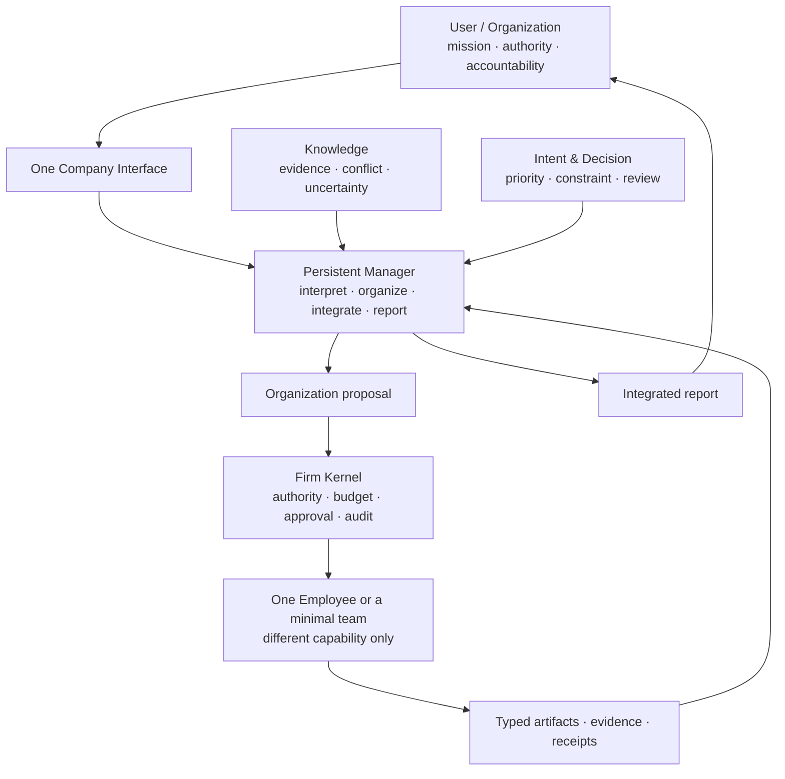

# 01 — Dynamic Firm Runtime

> 정본: [English](../en/01-dynamic-firm-runtime.md) · [← North Star](00-north-star.md) · [문서 인덱스](README.md) · [다음: Persistent Employee →](02-persistent-employee.md)

## 한 문장 정의

**Dynamic Firm Runtime**은 지속되는 회사 상태와 Employee를 바탕으로, 요청마다 필요한 최소 실행 구조를 만들고,
실행 결과와 검증된 근거에 따라 다음 작업의 능력을 개선하는 운영 모델입니다.

Noruct는 단일 agent를 더 길게 실행하는 제품이 아니라, 다음 네 가지를 함께 다룹니다.

```text
Persistent company state
+ capability-different Employees
+ request-scoped execution graph
+ deterministic authority and audit
```

## Manager와 Kernel의 분리

Manager는 목표의 모호함, 필요한 capability, 근거의 충족 여부, 사람에게 올려야 할 판단을 의미 단위로 다룹니다.
반면 Firm Kernel은 예산, 승인, 허용된 변이, 실행 상태, 영수증 같은 기계적 경계를 강제합니다. 따라서 Manager가
구조 변경을 제안할 수는 있어도, 스스로 권한 규칙을 풀 수는 없습니다.

이 구분은 LLM이 계획과 정책 집행을 동시에 독점하는 구조를 피하기 위한 것입니다.

## 왜 회사 형태인가

같은 model·tool·skill·permission을 가진 agent clone에 서로 다른 역할 이름만 붙이면, 이것은 전문 조직이 아니라
병렬 실행일 뿐입니다. 같은 오해와 정보 공백이 반복되고, 역할극성 대화와 비용만 늘어날 수 있습니다.

Noruct에서 회사라는 말은 부서·직급·회의를 복제한다는 뜻이 아닙니다. 다음의 유용한 구조만 가져옵니다.

- 지속되는 identity와 capability의 roster
- 목적, 권한, 예산, 검토 규칙의 분리
- 요청별 최소 팀과 명시적인 산출물 흐름
- 실행 결과와 장기 outcome을 구분하는 기록
- 검증된 경우에만 적용되는 versioned 개선

## 전체 구조



## 실행 형태

| 형태 | 의미 |
|---|---|
| Direct | Manager 또는 한 Employee가 bounded task를 직접 수행합니다. |
| Solo | 한 specialist가 필요하지만 별도 팀은 필요하지 않습니다. |
| Team | 실제 capability 차이와 dependency·review 가치가 있을 때만 최소 팀을 구성합니다. |

Graph Engineering은 시각적 graph 제작이나 역할 분배가 아닙니다. 실제로 다른 Employee capability를 task,
dependency, evidence, validation 관계로 연결하는 실행 구조를 설계하는 일입니다.

## 지속되는 것과 요청마다 끝나는 것

| 지속 상태 | 요청 한정 상태 |
|---|---|
| Company policy, roster, approved Skill, validated playbook, user Knowledge/Intent reference | Work order, project team, job graph, temporary role, one Employee run |

Job이 끝나면 그 실행 구조의 권한도 끝납니다. 다만 반복된 outcome과 검토를 통과한 절차·조직·협업 방식은 다음
Job에서 재사용할 수 있는 versioned 개선 후보가 될 수 있습니다.

## 권한 원칙

Manager와 Employee는 판단과 제안을 할 수 있지만, 그 자체가 권한은 아닙니다. Firm Kernel과 사용자 정책이
permission, budget, approval, external action, 실행 구조 변경을 검증합니다. 이 분리는 더 많은 agent를 만드는
것보다 중요합니다.
