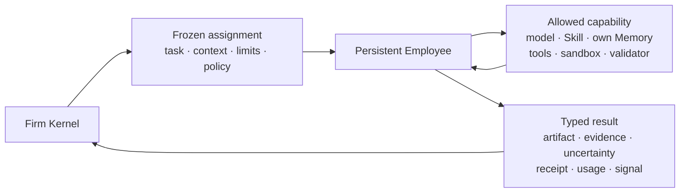

# 02 — Persistent Employee

> 정본: [English](../en/02-persistent-employee.md) · [← Dynamic Firm Runtime](01-dynamic-firm-runtime.md) · [문서 인덱스](README.md) · [다음: Knowledge, Intent & Firm →](03-knowledge-intent-firm.md)

## 정의

Noruct의 **Employee**는 역할 이름, prompt persona, 일회성 sub-agent 또는 한 번의 model call이 아닙니다.
여러 Job에서 다시 선택될 수 있는 persistent execution identity이며, 자신에게 허용된 capability만 사용해 bounded
assignment를 수행하고, 검증 가능한 결과와 관찰을 회사에 반환하는 runtime unit입니다.

```text
Persistent Employee
= identity + capability profile + private bounded state
+ frozen assignment + execution loop + typed result

≠ role prompt
≠ disposable clone
≠ Company authority
≠ user Knowledge database
```

## Employee는 무엇이 다른가

별도 Employee라고 부르려면 최소 하나 이상의 실제 차이가 있어야 합니다.

- model or inference profile
- Skill과 procedure revision
- tool, execution environment, permission과 effect scope
- Knowledge 접근 범위 또는 Memory/session namespace
- validator와 acceptance method
- 검증된 성과·비용·실패 이력

이름, task label, role prompt만 다른 instance는 다른 전문 Employee가 아닙니다. acceptance 품질·coverage·진단·지연까지
고려해 한 명이 충분하면 team을 만들지 않습니다. 단순히 완료 가능하다는 이유만으로 가치 있는 bounded replica를
억제하지는 않습니다.

## 받는 것 · 사용하는 것 · 반환하는 것



### 받는 것

| 입력 | 의미 |
|---|---|
| Employee snapshot | identity, active capability revision, selected Skill/Memory와 authority context |
| Task | objective, required capability, input artifact, acceptance, risk, expected output |
| Bounded context | 필요한 dependency result, cited evidence, selected own Memory, policy excerpt |
| Limits | time, model/tool call, token, output size, cost, error bound |
| Action policy | allowed tool/effect/resource, approval, network/filesystem, sandbox |
| Oracle or validator | 무엇이 success, failure, uncertain인지 확인하는 기준 |

입력은 run 동안 고정됩니다. 실행 중 roster, Skill, model 설정 또는 사용자 방향이 바뀌어도 현재 assignment의 뜻이
조용히 바뀌지 않습니다.

### 사용하는 것

Employee는 request에 명시된 model, Skill, 자기 Memory/session, bounded Knowledge evidence, approved tool grant,
sandbox와 validator만 사용합니다. 도구가 보인다는 사실은 실행 권한을 뜻하지 않으며, effect scope와 필요한
사용자 승인을 모두 통과해야 합니다.

Employee는 다른 Employee의 hidden reasoning, 전체 Company state, raw credential, 임의 shell, 무제한 network,
자동 tool 설치 또는 자기 승인 권한을 직접 사용하지 않습니다.

### 반환하는 것

| 반환물 | 사용처 |
|---|---|
| deliverable / artifact | 다음 task 또는 Manager의 최종 통합 |
| acceptance evidence | validator, test, observation, source citation |
| epistemic state | assumption, conflict, freshness, unresolved issue |
| action receipt | approval, effect, tool result와 실패 경계의 감사 |
| usage and terminal state | cost, time, status, partial result |
| typed signal | capability gap, blocked dependency, follow-up 또는 user question |
| learning observation | 검토 가능한 procedure/failure evidence; 자동 학습은 아님 |

Employee output은 proposal과 evidence입니다. 그것이 ROSTER, budget, permission, graph, Skill 또는 workflow를 직접
바꾸지는 않습니다.

## Manager와 specialist

Manager는 Persistent Employee의 특수형입니다. Manager는 사용자 목표, Intent/Decision, roster capability와 Job
상태를 읽고, 직접 처리·solo delegation·team 구성·결과 통합을 제안합니다. 그러나 Manager도 Company authority가
아니며 자기 budget, permission, approval 또는 roster를 바꿀 수 없습니다.

| Specialist | Manager |
|---|---|
| bounded domain task를 수행 | 목표 해석, staffing proposal, conflict 해석, 통합 보고 |
| artifact/evidence/receipt을 반환 | Work Order·assignment proposal과 단일 사용자 보고를 반환 |

## 협업 방식

Noruct의 협업 primitive는 자유 회의가 아니라 artifact handoff입니다.

```text
bounded assignment
→ artifact + cited evidence + assumption + validation + unresolved issue
→ 필요한 부분만 다음 Employee 또는 Manager에 투영
→ next bounded assignment or final integration
```

이 방식은 역할극성 대화를 줄이고, 어떤 근거가 어떤 결론에 영향을 주었는지 추적할 수 있게 합니다.

## 수명과 성장

Persistent Employee는 identity, capability revision, bounded session/memory namespace와 outcome reference를 Job 사이에
유지합니다. 반면 EmployeeRun, task context, tool grant와 temporary role은 Job 또는 attempt가 끝나면 실행 권한을
잃습니다.

성장은 무제한 transcript 저장이나 model weight training이 아닙니다. 반복 outcome과 검토를 통과한 Skill, workflow,
roster 변경만 새 version으로 선택될 수 있습니다.

## 한 Employee와 여러 실행 instance

Employee identity와 Employee 실행 instance는 서로 다른 객체입니다.

| 객체 | 지속 여부 | 별도 capability 보유 | 목적 |
|---|---|---|---|
| Employee | 명시적으로 개정·휴면·퇴역할 때까지 지속 | 예 | 재사용 가능한 capability, 도구, Skill, bounded Memory, 권한, outcome 이력 |
| Execution instance | Job 또는 attempt 한정 | 아니오. Employee의 frozen snapshot을 받음 | Job Graph 안의 한 bounded assignment 수행 |

같은 Employee의 instance를 한 Job에 여러 개 둘 수 있는 경우는 다음 세 가지입니다.

- **Partition:** 겹치지 않는 scope가 임계 경로를 줄이거나 coverage를 늘릴 때
- **Candidate:** 선언된 acceptance method로 비교할 수 있는 bounded 대안이 있을 때
- **Diagnostic:** 특정한 미해결 불확실성을 줄이는 독립 probe가 필요할 때

instance는 Employee identity, Skill, Memory policy, permission 또는 roster를 수정할 수 없습니다. 서로 대화해 인위적인
다양성을 만들지 않으며, 산출물은 선언된 aggregation task로 모입니다. aggregation 비용도 Job 예산에 포함됩니다.

따라서 복제 실행은 새 Employee, 승격 근거, 독립 Reviewer 또는 roster 확장 증거가 아닙니다. 반복된 outcome 근거만
나중의 Skill·Workflow·Roster Patch 제안을 정당화할 수 있습니다.
