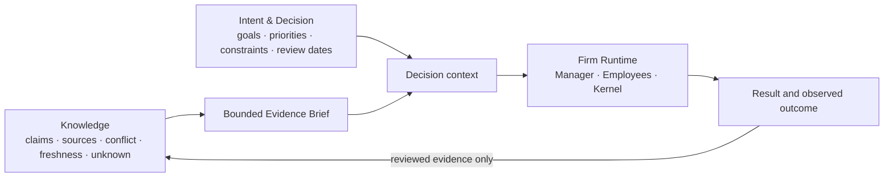
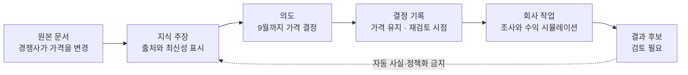

# 03 — Knowledge, Intent & Firm

> 정본: [English](../en/03-knowledge-intent-firm.md) · [← Persistent Employee](02-persistent-employee.md) · [문서 인덱스](README.md) · [다음: Graph & Firm Engineering →](04-graph-and-firm-engineering.md)

Noruct는 지식 저장소와 실행 회사를 섞지 않습니다. 무엇을 아는지, 무엇을 원하는지, 지금 무엇을 실행할 수
있는지는 서로 다른 권한을 가진 세 plane입니다.

## 초록

이 문서는 지속되는 AI 회사를 위한 세 평면 구조를 제안합니다. 지식은 어떤 자료와 출처가 무엇을 뒷받침하는지
답합니다. 의도와 결정은 사용자가 무엇을 추구하고 무엇을 선택했는지 답합니다. 회사 실행은 지금 무엇을 해도 되는지
답합니다. 세 평면은 무제한 맥락이나 권한이 아니라 제한된 참조만 주고받습니다.

사용자의 PDF, 문서, 이미지, 링크, 메모처럼 날것으로 들어온 자료는 Knowledge Runtime의 원천 자료입니다.
그 자체가 모든 작업에 자동으로 주입되는 prompt나 실행 명령이 되지 않습니다. 필요한 경우에만 근거·최신성·모순·불확실성을
포함한 짧은 Evidence Brief로 만들어 Intent와 Firm에 전달합니다.

## 명시적 Bridge

세 plane의 연결은 자동 혼합이 아니라 명시적 bridge입니다. 예를 들어 “이 PDF를 가격 전략 지식에 넣어”는 Knowledge
작업이고, “8월에 가격 결정을 재검토해”는 Intent의 일정화된 결정 기록이며, “그때 필요한 조사만 회사에 맡겨”가 Firm
Runtime의 실행 요청입니다. 실행 결과는 곧바로 지식이나 정책이 되지 않고, 각 plane에서 검토할 후보가 됩니다.

## Knowledge — What do we know?

Knowledge는 사용자가 가진 문서·근거·조사와 그 상태를 다룹니다. 중요한 것은 단순히 많은 문서를 context에 넣는
것이 아닙니다. claim, source, conflict, freshness, assumption과 unknown을 구분하고, 현재 task에 필요한 작은
Evidence Brief만 제공합니다.

Knowledge는 사용자 목표, 실행 권한 또는 최종 결정을 자동으로 만들지 않습니다.

## Intent & Decision — What do we want to do?

Intent & Decision은 목표, 우선순위, 제약, 결정, 보류, 책임자, 재검토 시점을 다룹니다. 예를 들어 자료는
“경쟁사가 가격을 올렸다”를 말할 수 있지만, 가격을 유지할지 바꿀지는 사용자·조직의 방향과 책임 문제입니다.

## Firm Runtime — What should we execute now?

Firm Runtime은 Manager, Employee와 Firm Kernel이 현재의 bounded task를 실행하는 plane입니다. Knowledge에서 필요한
근거를 받고 Intent의 제약을 존중하지만, 전체 지식이나 목표를 자기 권한으로 바꾸지 않습니다. 결과는 raw prompt,
transcript나 tool log의 재생이 아니라 완료 범위, 실제 기여 경계, 검증 공백, material alternative와 다음 안전한
행동을 설명하는 짧은 reviewable delivery와 opaque receipt reference로 반환합니다.

## 사용자 권한

사용자는 Mission, Authority, Accountability를 계속 소유합니다.

- 무엇을 우선할지와 어떤 trade-off를 받아들일지
- 어느 권한과 비용까지 허용할지
- 외부 약속, 비가역 action, 새로운 권한을 승인할지
- 결과를 현실의 성공으로 인정할지

Noruct는 명확하고 검증 가능하며 되돌릴 수 있는 영역에서는 자율 실행을 지향합니다. 가치 충돌, 불명확한 성공
기준, 큰 비용과 비가역 행동의 경계에서는 사용자의 판단을 대체하지 않습니다.

## 왜 분리해야 하는가

같은 문장도 평면마다 다른 뜻을 가집니다. 출처의 진술은 결정이 아니고, 결정은 세계가 동의한다는 근거가 아니며,
작업 결과는 자동으로 지속 지식이 되지 않습니다. 이 구분이 맥락 누적이 권한 루프로 바뀌는 일을 막습니다.

## 적용 범위의 경계

지식 런타임은 기록된 맥락, 출처 간 충돌, 최신성, 불확실성을 드러낼 수 있습니다. 기록되지 않은 암묵지를 복원하거나,
서로 다른 인간 가치를 대신 선택하거나, 비가역적 약속의 권한을 부여할 수는 없습니다. 이런 경우에는 질문을 좁히거나,
사용자에게 올리거나, 판단을 보류해야 합니다.
