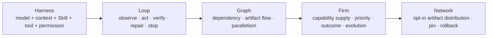

# 04 — Graph & Firm Engineering

> 정본: [English](../en/04-graph-and-firm-engineering.md) · [← Knowledge, Intent & Firm](03-knowledge-intent-firm.md) · [문서 인덱스](README.md) · [다음: Governed Evolution & User Graphs →](05-governed-evolution-and-user-graphs.md)

## 다섯 계층



Graph Engineering은 시각적 지식 그래프를 뜻하지 않으며, 같은 agent를 여러 개 만드는 것과도 다릅니다. 의존관계,
artifact 흐름, 병렬 가능한 경로를 설계하는 방식입니다. Firm Engineering은 그 노드가 서로 다른 capability·도구·권한·
검증 계약을 지닌 지속 Employee가 되도록 한 단계 확장합니다.

## 그래프가 복잡해질 조건

노드는 독립 작업으로 임계 경로를 줄이거나, 별도 capability 또는 도구 경계가 필요하거나, 불확실성을 줄이는 진단 probe,
독립 검증, 혹은 사용자가 선택한 유효한 Blueprint라는 근거가 있을 때만 추가됩니다. 그렇지 않으면 단일 Employee 또는
직접 응답이 더 낫습니다.

| 계층 | 다루는 질문 |
|---|---|
| Harness Engineering | 한 실행 instance가 무엇을 알고·사용하고·허용받는가? |
| Loop Engineering | 한 instance는 어떻게 observe·act·verify·repair·stop하는가? |
| Graph Engineering | 실제로 다른 capability를 가진 node를 어떻게 연결하는가? |
| Firm Engineering | 여러 Job에 capability를 어떻게 배치하고, 무엇을 장기적으로 남기는가? |
| Network Engineering | 검증된 artifact를 어떻게 선택적으로 배포·pin·rollback하는가? |

## Graph Engineering은 병렬 agent 수가 아니다

동일한 model, tool, Skill, permission, evidence를 가진 agent를 여러 개 만들고 task label만 달리하면, 오류
상관성이 그대로 남습니다. 이는 병렬화된 Loop Engineering일 수는 있어도 서로 다른 전문 조직은 아닙니다.

Graph의 node가 별도 Employee로 인정되려면 model, Skill, tool, permission, Knowledge scope, Memory, validator,
evaluation history 중 하나 이상이 실제로 달라야 합니다. 또한 그 차이가 현재 task에 필요하다는 이유가 있어야
합니다.

## Manager의 위치

Manager는 상시 감독 loop나 권한을 가진 CEO가 아닙니다. 다음 semantic boundary에서만 조직 판단을 합니다.

1. 목표를 Work Order로 해석할 때
2. direct, solo, team 중 최소 형태를 선택할 때
3. capability gap, 깨진 가정, 결과 충돌처럼 구조가 바뀌어야 할 때
4. 결과를 하나의 사용자 보고로 통합할 때
5. 지연된 outcome을 바탕으로 조직 판단을 검토할 때

dependency ready-set, lock, retry counter, approval wait, budget settlement, crash recovery는 model 호출이 아니라
Firm Kernel이 처리합니다.

## 협업 방식

Employee 간 기본 primitive는 회의가 아니라 typed artifact handoff입니다.

```text
assignment
→ artifact + evidence + assumption + validation + unresolved issue
→ 필요한 부분만 다음 node에 전달
→ next task or integration
```

이 방식은 숨은 사고 과정을 공유하지 않으면서 context 오염과 role-play token을 줄이고, 결과의 provenance를
추적하게 합니다.

## 한 명으로 충분하면 한 명

Team은 기본값이 아닙니다. independent deliverable, 실제 capability gap, 독립 검증 가치 또는 dependency-derived
parallelism이 있을 때만 team이 됩니다. 그렇지 않으면 direct 또는 solo 경로가 더 낮은 비용·지연·오류 표면을
가집니다.
