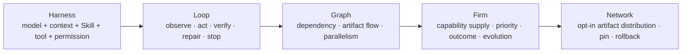
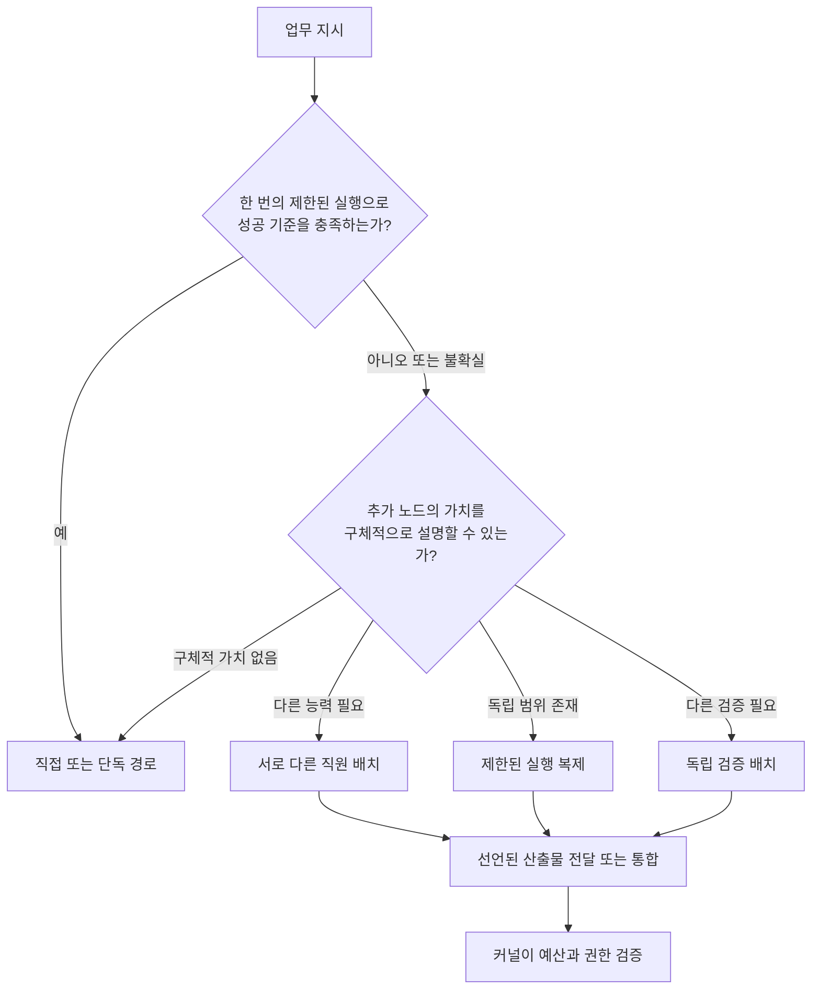
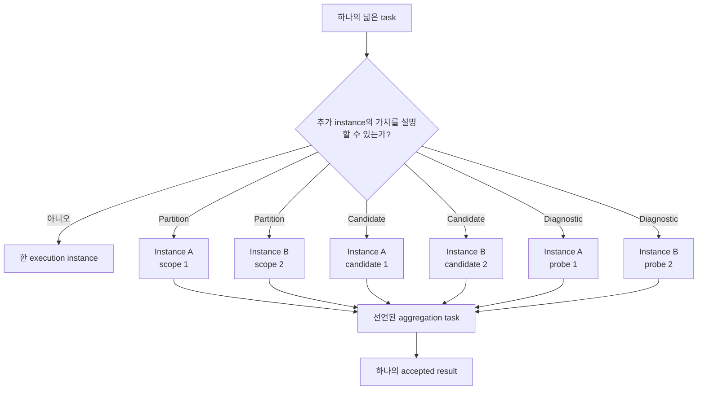

# 04 — Graph & Firm Engineering

> 정본: [English](../en/04-graph-and-firm-engineering.md) · [← Knowledge, Intent & Firm](03-knowledge-intent-firm.md) · [문서 인덱스](README.md) · [다음: Governed Evolution & User Graphs →](05-governed-evolution-and-user-graphs.md)

## 다섯 계층



Graph Engineering은 시각적 지식 그래프를 뜻하지 않으며, 같은 agent를 여러 개 만드는 것과도 다릅니다. 의존관계,
artifact 흐름, 병렬 가능한 경로를 설계하는 방식입니다. Firm Engineering은 그 노드가 서로 다른 capability·도구·권한·
검증 계약을 지닌 지속 Employee가 되도록 한 단계 확장합니다.

## 초록

이 문서는 에이전트 시스템 설계의 다섯 계층을 구분합니다. 그래프 공학은 의존관계와 산출물 흐름을 다루고, 회사
공학은 여기에 지속 능력의 공급, 권한, 결과 이력, 통제된 진화를 더합니다. 목적은 병렬화를 최대화하는 것이 아니라,
추가 비용의 가치를 설명하고 평가할 수 있는 구조만 만드는 것입니다.

## 그래프가 복잡해질 조건

노드는 독립 작업으로 임계 경로를 줄이거나, 별도 capability 또는 도구 경계가 필요하거나, 불확실성을 줄이는 진단 probe,
독립 검증, 혹은 사용자가 선택한 유효한 Blueprint라는 근거가 있을 때만 추가됩니다. 그렇지 않으면 단일 Employee 또는
직접 응답이 더 낫습니다.

## 구조 편성 검사



검사는 “병렬 실행이 가능한가”보다 엄격합니다. 노드는 어떤 작업을 바꾸는지, 기대 이득이 무엇인지, 입출력 계약이
무엇인지, 예산과 권한 경계가 어디인지 말할 수 있을 때만 추가됩니다.

## 주장하지 않는 것

회사 공학은 모든 영역에 사람처럼 세분화된 전문직이 필요하다고 가정하지 않습니다. 실제 운영 차이가 있을 때만
직원을 구분하고, 그렇지 않으면 하나의 능력 정체성을 유지합니다. 가치가 증명된 경우에만 임시 실행 복제를 쓰며,
조직 연극을 만들지 않습니다.

| 계층 | 다루는 질문 |
|---|---|
| Harness Engineering | 한 실행 instance가 무엇을 알고·사용하고·허용받는가? |
| Loop Engineering | 한 instance는 어떻게 observe·act·verify·repair·stop하는가? |
| Graph Engineering | 실제로 다른 capability를 가진 node를 어떻게 연결하는가? |
| Firm Engineering | 여러 Job에 capability를 어떻게 배치하고, 무엇을 장기적으로 남기는가? |
| Network Engineering | 검증된 artifact를 어떻게 선택적으로 배포·pin·rollback하는가? |

## Graph Engineering은 병렬 agent 수가 아니다

동일한 model, tool, Skill, permission, evidence를 가진 agent를 여러 개 만들고 task label만 달리하면, 오류
상관성이 그대로 남습니다. 이는 병렬화된 Loop Engineering일 수는 있어도 서로 다른 전문 조직은 아닙니다.

Graph의 node가 별도 Employee로 인정되려면 model, Skill, tool, permission, Knowledge scope, Memory, validator,
evaluation history 중 하나 이상이 실제로 달라야 합니다. 또한 그 차이가 현재 task에 필요하다는 이유가 있어야
합니다.

## Manager의 위치

Manager는 상시 감독 loop나 권한을 가진 CEO가 아닙니다. 다음 semantic boundary에서만 조직 판단을 합니다.

1. 목표를 Work Order로 해석할 때
2. direct, solo, team 중 최소 형태를 선택할 때
3. capability gap, 깨진 가정, 결과 충돌처럼 구조가 바뀌어야 할 때
4. 결과를 하나의 사용자 보고로 통합할 때
5. 지연된 outcome을 바탕으로 조직 판단을 검토할 때

dependency ready-set, lock, retry counter, approval wait, budget settlement, crash recovery는 model 호출이 아니라
Firm Kernel이 처리합니다.

## 동질 실행도 제한된 가치를 가질 수 있다

Graph의 모든 node가 항상 서로 다른 Employee일 필요는 없습니다. assignment 자체에 안전한 병렬 구조가 있으면 선택된
한 Employee를 여러 실행 instance로 배치할 수 있습니다. 이는 실행 최적화이지 Firm 수준의 다양성을 만드는 방식은
아닙니다.



구조적 제한은 다음과 같습니다.

- 하나의 frozen Employee capability snapshot에서 나온 2–4개의 run-only instance
- 겹치지 않는 partition scope 또는 명시적으로 비교 가능한 candidate·probe
- 숨은 예산 증액이 아닌 동일한 authority와 hard Job budget
- instance의 Employee·roster·Blueprint·Playbook 수정 금지
- 모든 member가 선언된 aggregation task를 통해 합류
- 독립 Reviewer는 단순 복제가 아니라 실제로 다른 validator 또는 capability 사용

## Performance-first 제안, hard-capped 실행

managed Job의 기본 제안 자세는 performance-first입니다. Manager와 Compiler는 work가 분리 가능한 넓은 범위,
비교할 가치가 있는 복수 candidate 또는 별도 probe가 유용한 불명확 원인을 가질 때 2–4개 replica 가설을 적극
검토합니다. 한 번의 실행이 기술적으로 완료 가능하다는 사실만으로 이 가설을 거절하지 않습니다.

hard budget은 ceiling이지 소비 목표가 아닙니다. concrete quality·coverage·recovery·latency 이득을 얻는 가장 작은
2–3개 group을 우선하고, 네 번째 instance는 scope 또는 candidate set 이유가 명확할 때만 씁니다. exact safe scope와
aggregation을 만들 수 없거나 provider가 실패하거나 Kernel admission을 통과하지 못하거나 사용자가 single/no-parallel을
요청하면 solo를 유지합니다. 제안은 공격적일 수 있지만 authority admission은 엄격하게 남습니다.

## 같은 총예산에서 가치를 검증한다

instance 수는 성공 지표가 아닙니다. 공정한 평가는 동일한 workload, environment, Employee capability revision, 총 hard
budget에서 단일 instance 실행과 복제 실행을 비교합니다. aggregation overhead도 복제 실행의 비용에 포함됩니다.

accepted quality, coverage, 완전 실패, safety·validation regression, latency, 총 resource 사용량을 함께 봅니다. 한 번의
좋은 결과만으로는 부족합니다. 서로 다른 workload에서 반복된 paired evidence가 필요하며, safety 또는 validation
regression이 나타나면 해당 구조를 중단하거나 rollback할 이유가 됩니다.

평가기의 출력은 evidence와 recommendation입니다. Blueprint를 조용히 수정하거나 Playbook을 자동 승격하지 않습니다.
실행 구조의 측정과 조직 권한 부여를 분리하기 위해서입니다.

## 협업 방식

Employee 간 기본 primitive는 회의가 아니라 typed artifact handoff입니다.

```text
assignment
→ artifact + evidence + assumption + validation + unresolved issue
→ 필요한 부분만 다음 node에 전달
→ next task or integration
```

이 방식은 숨은 사고 과정을 공유하지 않으면서 context 오염과 role-play token을 줄이고, 결과의 provenance를
추적하게 합니다.

## 결과 기준으로 한 명이 충분하면 한 명

Team은 기본값이 아닙니다. independent deliverable, 실제 capability gap, 독립 검증 가치 또는 dependency-derived
parallelism이나 replica-value가 있을 때 team이 됩니다. 여기서 충분성은 단순 완료 가능성이 아니라 acceptance 품질과
coverage·진단·지연을 포함합니다. 그렇지 않으면 direct 또는 solo 경로가 더 낮은 비용·지연·오류 표면을 가집니다.
