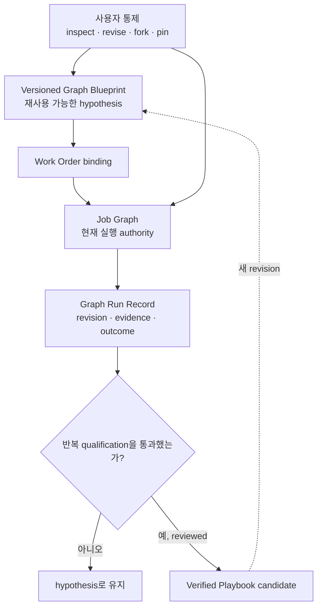
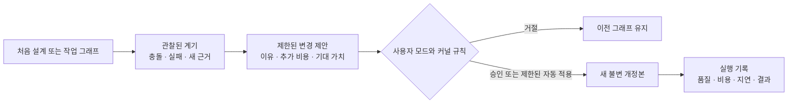

# 05 — Governed Evolution & User Graph Control

> 정본: [English](../en/05-governed-evolution-and-user-graphs.md) · [← Graph & Firm Engineering](04-graph-and-firm-engineering.md) · [문서 인덱스](README.md) · [다음: Epistemic Control, Oracle & Outcome →](06-epistemic-control-and-outcome.md)

## 실행 구조와 조직 능력의 분리

Noruct에서 workflow는 무조건 사라지는 일회용 object도, 한번 성공하면 영구 규칙이 되는 object도 아닙니다.
세 가지를 분리합니다.

## 초록

이 문서는 그래프를 숨은 컴파일러 산출물이 아니라 사용자가 볼 수 있는 버전 관리 가설로 다룹니다. 핵심 문제는
실행 중 그래프가 바뀌어도 비용, 원인, 사용자 통제가 사라지지 않게 하면서 적응성을 유지하는 것입니다.

| 객체 | 역할 | 수명과 권위 |
|---|---|---|
| Graph Blueprint | 재사용 가능한 실행 설계 초안 | 저장·fork·pin·공유 가능, 단독으로 실행 권한 없음 |
| Job Graph | 현재 Work Order에 binding된 실행 구조 | 해당 Job에서만 실행 권위 |
| Graph Run Record | initial graph, revision, evidence, result 기록 | 감사·비교·학습용, 실행 권한 없음 |

## 사용자가 고르는 구조 변경 범위

| 모드 | Runtime 동작 |
|---|---|
| Locked | 선언된 구조를 따르고, 부족하면 변경을 요청합니다. |
| Propose | 변경 이유, 예상 비용, 기대 효과와 함께 제안합니다. |
| Bounded automatic | 미리 허용된 가역적 변경만 제한 안에서 적용합니다. |

그래프 변경이 생기면 이전 revision, 변경을 유발한 근거, 승인한 사람 또는 정책, 예약·소비 비용, 품질·지연에 미친 결과를
Run Record에 남겨야 합니다. 적응성은 설명 가능성을 포기하는 이유가 될 수 없습니다.

## 현재 개발 위치

현재 로컬 개발 경로는 terminal surface에서 Blueprint catalog, preview, structured revision, fork, pin, 사용자 제약,
retained run lineage를 제공합니다. 실행 중 `PROPOSE` revision은 Job을 pause할 수 있고, 같은 frozen Work Order,
prior graph, lease를 다시 대조한 정확한 승인·거절 receipt가 있을 때만 이어집니다. 이는 일반적인 checkpoint replay보다
좁은 경계입니다. failed·in-flight·effectful 작업은 조용히 재개하지 않습니다.

독립 desktop/web control surface는 아직 future projection이며, graph revision이 실제 quality·cost·latency에 미친
인과 효과를 계산하는 일도 아직 평가 과제입니다.

이 분리 덕분에 사용자는 자동으로 생성된 Graph를 볼 수 있고, 제약을 걸고, 수정하고, 저장하고, 공유할 수 있습니다.
동시에 저장된 설계가 사용자 승인 없이 미래 실행을 지배하지는 않습니다.

## 사용자 Graph 통제

사용자는 다음을 할 수 있어야 합니다.

- 현재 Graph와 담당 Employee, dependency, budget envelope를 inspect
- Employee pin/exclude, mandatory review, concurrency·cost·time ceiling을 지정
- 실행 중 변경을 lock, proposal review, bounded automatic revision 중 하나로 선택
- 유용한 구조를 draft로 저장하고 fork·pin·share

사용자 편의는 구조에 대한 폐쇄성을 뜻하지 않습니다. 자동 설계와 사용자 agency는 함께 존재해야 합니다.

## Blueprint의 실행 복제 표현

Versioned Blueprint는 한 Employee에 여러 Job-local execution assignment를 배치하는 구조를 선언할 수 있습니다. 이때
strategy, 각 bounded scope, aggregation task, 기대하는 한계가치를 함께 명시해야 합니다. 그래야 복제 구조가 숨은
compiler trick이 아니라 사용자가 inspect하고 수정할 수 있는 설계가 됩니다.

이 선언은 hypothesis입니다. Employee를 여러 durable identity로 복제했다는 뜻도 아니며 효율이 입증되었다는 뜻도
아닙니다. 사용자는 다른 Graph 선택과 같은 Blueprint revision 모델로 이 제안을 수정·제거·lock·fork·pin할 수 있습니다.

자동 proposal과 durable reuse의 기준은 다릅니다. performance-first Manager는 현재 work에서 명확한 partition,
candidate 또는 diagnostic opportunity를 발견하면 bounded replica group을 일찍 제안할 수 있습니다. 하지만 이것이
검증된 조직 자산이라는 뜻은 아닙니다. 이후의 paired outcome만 reusable recommendation을 qualification할 수 있고,
그 결과조차 스스로 authority를 바꾸지는 못합니다.

## Qualification은 권한을 자동 변경하지 않는다

복제 구조가 재사용 recommendation이 되기 전에는 동일한 workload, environment, Employee capability, 총 hard budget의
단일 실행 baseline과 비교해야 합니다. evidence에는 instance 완료 개수가 아니라 aggregation overhead와 outcome
지표가 포함되어야 합니다.

한 쌍의 비교는 유용한 signal이나 regression을 찾을 수 있지만 promotion 근거로는 부족합니다. 최초 qualification
규칙은 서로 다른 workload의 paired trial을 최소 3개 요구하고 그중 3분의 2 이상에서 value signal이 있어야 하며,
safety, validation 또는 중요한 quality regression은 즉시 실패로 취급합니다. 긍정적인 qualification 결과도 advisory일
뿐입니다. pinned Blueprint 변경 또는 Playbook 승격은 명시적이고 versioned이며 검토 가능한 별도 행동입니다.

## 변화가 실행 중 일어날 때

실행 중 Graph가 바뀌면 이유와 비용을 숨기지 않습니다. 각 revision은 이전/다음 구조, 변경 종류, trigger evidence,
승인 상태, 예상 영향과 관측 outcome을 남겨야 합니다. 그래야 최초 계획과 최종 구조의 차이, 변화가 품질·비용·지연에
미친 영향을 설명할 수 있습니다.

## 구조 변경의 인과 기록

공개 원칙은 모든 그래프가 바뀌어야 한다는 뜻이 아닙니다. 중요한 변경이라면 이유와 제한된 효과를 재구성할 수 있는
결정으로 남아야 한다는 뜻입니다.

## 세 종류의 누적 변화

| Patch | 바꾸는 것 |
|---|---|
| Skill Patch | 한 Employee의 재사용 가능한 절차와 전문성 |
| Workflow Patch | task 분해, routing, artifact handoff, review 방식 |
| Roster Patch | Employee 생성, 통합, 휴면, capability 또는 authority |

한 번의 성공, 다수결, 자기평가, 다운로드 수는 자동 승격의 근거가 아닙니다. 반복 evidence, outcome, attribution,
review, versioning과 rollback 경계를 통과한 변화만 다음 Job에 반영됩니다.

## 임시 역할과 영구 Employee

capability gap 때문에 temporary role을 만들 수는 있습니다. 그러나 임시 역할은 현재 Job의 필요한 capability bundle일
뿐입니다. 성공 한 번 뒤 Memory, Skill, permission 또는 roster identity를 자동으로 얻지 않습니다. 반복된 필요와
검증된 outcome이 있을 때만 persistent Employee 후보가 됩니다.
