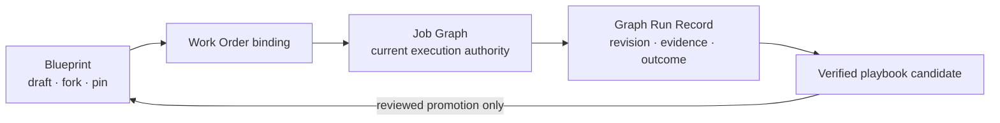

# 05 — Governed Evolution & User Graph Control

> 정본: [English](../en/05-governed-evolution-and-user-graphs.md) · [← Graph & Firm Engineering](04-graph-and-firm-engineering.md) · [문서 인덱스](README.md) · [다음: Epistemic Control, Oracle & Outcome →](06-epistemic-control-and-outcome.md)

## 실행 구조와 조직 능력의 분리

Noruct에서 workflow는 무조건 사라지는 일회용 object도, 한번 성공하면 영구 규칙이 되는 object도 아닙니다.
세 가지를 분리합니다.

| 객체 | 역할 | 수명과 권위 |
|---|---|---|
| Graph Blueprint | 재사용 가능한 실행 설계 초안 | 저장·fork·pin·공유 가능, 단독으로 실행 권한 없음 |
| Job Graph | 현재 Work Order에 binding된 실행 구조 | 해당 Job에서만 실행 권위 |
| Graph Run Record | initial graph, revision, evidence, result 기록 | 감사·비교·학습용, 실행 권한 없음 |

## 사용자가 고르는 구조 변경 범위

| 모드 | Runtime 동작 |
|---|---|
| Locked | 선언된 구조를 따르고, 부족하면 변경을 요청합니다. |
| Propose | 변경 이유, 예상 비용, 기대 효과와 함께 제안합니다. |
| Bounded automatic | 미리 허용된 가역적 변경만 제한 안에서 적용합니다. |

그래프 변경이 생기면 이전 revision, 변경을 유발한 근거, 승인한 사람 또는 정책, 예약·소비 비용, 품질·지연에 미친 결과를
Run Record에 남겨야 합니다. 적응성은 설명 가능성을 포기하는 이유가 될 수 없습니다.

이 분리 덕분에 사용자는 자동으로 생성된 Graph를 볼 수 있고, 제약을 걸고, 수정하고, 저장하고, 공유할 수 있습니다.
동시에 저장된 설계가 사용자 승인 없이 미래 실행을 지배하지는 않습니다.

## 사용자 Graph 통제

사용자는 다음을 할 수 있어야 합니다.

- 현재 Graph와 담당 Employee, dependency, budget envelope를 inspect
- Employee pin/exclude, mandatory review, concurrency·cost·time ceiling을 지정
- 실행 중 변경을 lock, proposal review, bounded automatic revision 중 하나로 선택
- 유용한 구조를 draft로 저장하고 fork·pin·share

사용자 편의는 구조에 대한 폐쇄성을 뜻하지 않습니다. 자동 설계와 사용자 agency는 함께 존재해야 합니다.

## 변화가 실행 중 일어날 때

실행 중 Graph가 바뀌면 이유와 비용을 숨기지 않습니다. 각 revision은 이전/다음 구조, 변경 종류, trigger evidence,
승인 상태, 예상 영향과 관측 outcome을 남겨야 합니다. 그래야 최초 계획과 최종 구조의 차이, 변화가 품질·비용·지연에
미친 영향을 설명할 수 있습니다.

## 세 종류의 누적 변화

| Patch | 바꾸는 것 |
|---|---|
| Skill Patch | 한 Employee의 재사용 가능한 절차와 전문성 |
| Workflow Patch | task 분해, routing, artifact handoff, review 방식 |
| Roster Patch | Employee 생성, 통합, 휴면, capability 또는 authority |

한 번의 성공, 다수결, 자기평가, 다운로드 수는 자동 승격의 근거가 아닙니다. 반복 evidence, outcome, attribution,
review, versioning과 rollback 경계를 통과한 변화만 다음 Job에 반영됩니다.

## 임시 역할과 영구 Employee

capability gap 때문에 temporary role을 만들 수는 있습니다. 그러나 임시 역할은 현재 Job의 필요한 capability bundle일
뿐입니다. 성공 한 번 뒤 Memory, Skill, permission 또는 roster identity를 자동으로 얻지 않습니다. 반복된 필요와
검증된 outcome이 있을 때만 persistent Employee 후보가 됩니다.
