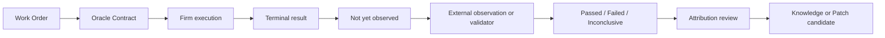

# 06 — Epistemic Control, Oracle & Outcome

> 정본: [English](../en/06-epistemic-control-and-outcome.md) · [← Governed Evolution & User Graphs](05-governed-evolution-and-user-graphs.md) · [문서 인덱스](README.md) · [다음: Network Engineering →](07-network-engineering.md)

AI agent가 약한 지점은 단순히 추론이 어려운 일이 아니라, 목적·정답·권한·책임이 외부에 있는데도 스스로 그것을
소유해야 하는 일입니다. Noruct는 이 문제를 지식과 실행을 분리하는 것만으로 해결한다고 주장하지 않습니다.
대신 무엇을 알고 모르며, 어떤 기준으로 결과를 판정하는지를 명시합니다.

Knowledge Runtime은 기록되지 않은 암묵지, 가치 충돌의 정답, 법적·비가역적 행동을 할 정당한 권한을 만들어주지
않습니다. 다만 근거의 출처, 모순, 최신성, 불확실성 및 과거 결정을 보존해 더 나은 판단을 돕습니다.

## 인식 상태

| 상태 | 의미 |
|---|---|
| Observed | source 또는 직접 관측으로 뒷받침된 주장 |
| Inferred | 관측에서 나온 해석이지만 직접 확인되지 않은 주장 |
| Assumed | 실행을 위해 임시로 채택한 전제 |
| Decided | 권한자가 선택한 방향; 사실과 다름 |
| Disputed | 유효한 근거 사이에 충돌이 존재 |
| Stale | freshness 또는 review boundary를 지남 |
| Unknown | 현재 근거로 답을 판정할 수 없음 |

높은 model confidence는 Observed가 아니며, 사용자나 조직의 결정은 세계에 대한 사실이 아닙니다.

## 네 가지 artifact

### Bounded Evidence Brief

한 질문이나 task에 필요한 최소 claim, source, conflict, freshness, unknown, constraint만 담는 지식 투영입니다.
전체 파일, 전체 transcript 또는 외부 문서의 명령을 그대로 실행 context의 권위로 만들지 않습니다.

### Decision Context Snapshot

결정·실행 당시의 evidence, known/unknown, assumption, constraint, excluded alternative와 authority reference를
고정합니다. 나중에 결과가 나빴을 때 정보 부족, 오래된 근거, 잘못된 판단, 실행 오류와 잘못된 성공 기준을
구분할 수 있게 합니다.

### Oracle Contract

Oracle은 무오류 심판이 아니라, Work Order가 success·failure·inconclusive을 어떤 observable과 validator로
판정할지 정하는 계약입니다. 결정론적 test, 외부 관측, 독립 validator, 인간 검토, sandbox simulation 중 무엇이
사용되는지와 proxy metric의 한계를 명시합니다.

### Outcome & Feedback Ledger

Job이 terminal success로 끝났다는 사실과 현실의 성공은 다릅니다. 결과는 `not yet observed`, `passed`, `failed`,
`inconclusive` 같은 실제 관측 상태와 연결되어야 합니다. outcome 하나만으로 조직 능력이 개선됐다고 단정하지
않습니다.

## Knowledge가 줄일 수 있는 것과 남는 것

Knowledge Runtime은 기록된 맥락 손실, 근거 없는 확신, 장기 작업의 전제 이탈, 결과 피드백 단절을 줄일 수
있습니다. 그러나 사용자의 가치 선택, 정당한 권한, 법적·도덕적 책임, 기록되지 않은 암묵지, 관측 불가능한
성공 기준을 자동으로 해결하지는 않습니다.

따라서 중요한 경계에서는 사용자가 계속 판단합니다. AI는 선택지, 근거, 반론, 실행 준비와 검증 결과를 더
잘 제공할 수 있지만 Mission, Authority, Accountability를 대신 소유하지 않습니다.
