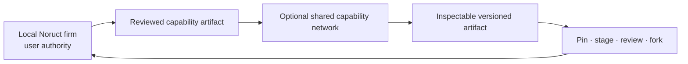
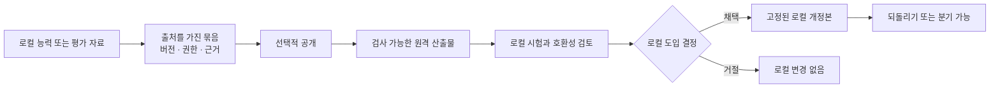

# 07 — Network Engineering

> 정본: [English](../en/07-network-engineering.md) · [← Epistemic Control, Oracle & Outcome](06-epistemic-control-and-outcome.md) · [문서 인덱스](README.md)

Network Engineering은 하나의 로컬 회사 위에 선택적으로 놓이는 계층입니다. 목표는 여러 사용자의 지식이나 권한을
한데 모으는 것이 아니라, 검토 가능한 재사용 capability를 회사 사이에 안전하게 이동시키는 것입니다.

## 초록

이 문서는 공유 개선을 위한 로컬 우선 모델을 정의합니다. 네트워크는 검사 가능한 능력 산출물을 배포할 수 있지만,
기여의 대가로 개인 맥락을 넘기게 하거나, 공개된 산출물이 원격 실행 권한을 갖게 해서는 안 됩니다.

## 공유할 수 있는 것

공유의 단위는 raw data가 아니라 버전과 provenance를 가진 artifact입니다. 예를 들어 Skill package, tool adapter
정의, Employee capability contract, Graph Blueprint, benchmark, verification recipe, compatibility record가 이에
해당합니다. 각 artifact에는 버전, 선언된 권한, 평가 근거, 호환성, rollback 경로가 있어야 합니다.

## 로컬에 남아야 하는 것

사용자 원본 파일, private knowledge store, credential, 진행 중인 Job 상태, private conversation, 민감한 receipt,
문서화되지 않은 조직 맥락은 공유 capability가 아닙니다. 네트워크 참여를 위해 이런 데이터를 제출하게 해서는 안 됩니다.

## 도입은 로컬의 결정

기본은 자동 import·자동 activation 없음입니다. 사용자는 artifact를 검사하고, 버전을 비교하고, 특정 버전을 pin하고,
제한된 환경에 stage하고, 채택·거절·fork·rollback할 수 있습니다. “항상 최신”은 네트워크의 권리가 아니라 사용자가
선택하는 업데이트 정책입니다.

## 산출물의 생명주기

핵심은 **사용 가능함**과 **권한을 가짐**의 차이입니다. 네트워크는 산출물을 사용할 수 있게 할 수 있지만, 활성화할
수 있는 권한은 오직 로컬 사용자 또는 로컬 정책에 있습니다.

## 현재 개발 위치

현재 개발 구현에는 signed·versioned Artifact lifecycle이 있습니다. discover, verify, stage, review, install,
future Job activation, pin, rollback을 지원하며, first-party·community·private-team source class를 구분합니다.
credential은 local artifact catalog 밖에 남고, 배포된 read-only registry endpoint는 availability surface일 뿐
local Company나 실행 중 Job을 바꾸지 못합니다.

현재 공개된 first-party artifact는 의도적으로 synthetic·experimental입니다. 이는 distribution path를 보이는
검증용 release이지 customer-ready marketplace나 automatic update channel이 아닙니다. customer self-service,
consent operation, broad executable adapter, production qualification은 현재 주장 범위 밖입니다.

Network Engineering은 Firm Engineering을 대체하지 않습니다. 로컬 회사가 상태와 권한의 정본으로 남고, 네트워크는
선택 가능한 능력의 출처로만 작동합니다.
