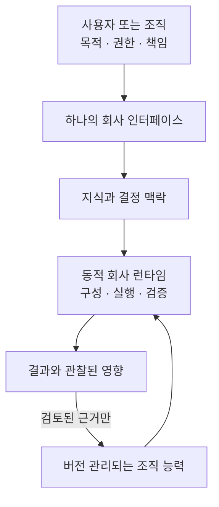

# Noruct 공개 개념 문서

> 정본: [English canonical documentation](../en/README.md) · 이 문서는 한국어 번역본입니다.

## 초록

Noruct의 공개 문서는 제품이 무엇을 목표로 하고, 어떤 권한 경계와 운영 원칙을 지키는지 설명합니다. Noruct는
사용자의 목표·지식·결정·실행 권한을 하나의 지속되는 회사 운영 구조로 연결하되, 근거로 정당화된 조직 능력만
다음 작업에 남기려는 개념입니다. 이 문서는 구현 설명서나 모든 선택 기능의 제공 약속이 아닙니다.

## 중심 명제

> **실행 흐름은 임시이고, 조직 능력은 누적된다.**

사용자는 작업마다 에이전트 구조를 설계하지 않아도 됩니다. 반대로 한 번의 작업 구조가 회사의 영구 규칙이 되어서도
안 됩니다. 그리고 어떤 모델도 사용자의 가치, 비가역적 권한, 책임을 자동으로 소유할 수 없습니다.

이 명제의 운영 결과는 **최소 충분 조직**입니다. 추가 가치를 모르면 direct 또는 strong solo가 baseline이며, 추가
Employee·execution instance·Manager 단계·reviewer는 각각 실질 기여와 통합 경계를 설명해야 합니다. 결과는 사람이
raw log에서 결론을 재구성하게 하지 않고 짧고 검토 가능한 전달물로 끝나야 합니다.

## 읽는 방법

문서는 목적에서 시작해 실행 구조, 직원, 지식과 결정, 그래프, 진화, 인식 통제, 선택적 네트워크 순서로 전개됩니다.
각 문서는 세 가지를 구분합니다. **명제**는 Noruct가 제안하는 바이고, **작동 원리**는 그 명제를 지키는 방식이며,
**경계**는 그 원리를 무엇으로 오해하면 안 되는지를 뜻합니다.

| 순서 | 문서 | 질문 | 논지에서의 역할 |
|---:|---|---|
| 00 | [지향점](00-north-star.md) | 왜 단일 에이전트가 아니라 회사 런타임을 만드는가? | 인간의 권한과 지속성의 기준을 세운다. |
| 01 | [동적 회사 런타임](01-dynamic-firm-runtime.md) | 회사의 지속 상태와 요청별 실행 구조는 어떻게 분리되는가? | 회사·관리자·커널·직원·그래프·감사의 관계를 정의한다. |
| 02 | [지속 직원](02-persistent-employee.md) | 직원은 무엇을 받고·사용하고·반환하는가? | 실제 전문성과 개인 상태의 조건을 정의한다. |
| 03 | [지식·의도·회사](03-knowledge-intent-firm.md) | 지식, 사용자 방향, 실행 권한은 어떻게 연결되는가? | 자료·결정·실행이 하나의 권한이 되는 일을 막는다. |
| 04 | [그래프와 회사 공학](04-graph-and-firm-engineering.md) | 그래프 공학은 단순 다중 에이전트와 무엇이 다른가? | 그래프가 비용을 정당화하는 조건을 설명한다. |
| 05 | [통제된 진화와 사용자 그래프](05-governed-evolution-and-user-graphs.md) | 실행 구조는 어떻게 재사용·수정·공유하되 권한을 잃지 않는가? | 가설, 작업 권한, 학습을 분리한다. |
| 06 | [인식 통제·판정 기준·결과](06-epistemic-control-and-outcome.md) | 무엇을 알고 모르며, 결과의 성공을 어떻게 판정하는가? | 불확실성과 지연된 결과를 다룬다. |
| 07 | [네트워크 공학](07-network-engineering.md) | 재사용 가능한 능력을 어떻게 공유하되 사용자 권한을 지키는가? | 선택적·로컬 우선 능력 교환을 정의한다. |
| 08 | [현재 개발 상태](08-current-development-status.md) | 무엇이 구현되었고, 무엇이 실험적 또는 미검증인가? | 개념 논문과 현재 개발 근거를 분리한다. |
| 09 | [조직은 직책이 아니라 의사결정 구조다](09-organization-as-decision-architecture.md) | 에이전트 워크플로는 언제 조직이 되며, 얼마나 작아야 하고 무엇을 설명해야 하는가? | 과업·배치·정보·통신·권한·검증·학습을 분리한 뒤 최소 충분 조직과 검토 가능한 전달을 정의한다. |

## 공개 문서의 경계

이 문서는 제품 방향과 사용자에게 약속하는 동작 원칙을 설명합니다. source intake, runtime implementation,
보안 운영 세부, 벤치마크, 고객 데이터와 개발 이력은 포함하지 않습니다.

영문판과 번역판의 표현이 다를 경우 영문판이 정본입니다.

[현재 개발 상태](08-current-development-status.md)만이 이 문서 묶음에서 현재 구현 근거를 요약합니다. 나머지
문서는 목표 아키텍처와 제품 경계를 설명하며, 문서에 등장한다고 해서 모든 기능이 일반 제공되거나 상용 검증을
마쳤다는 뜻은 아닙니다.
